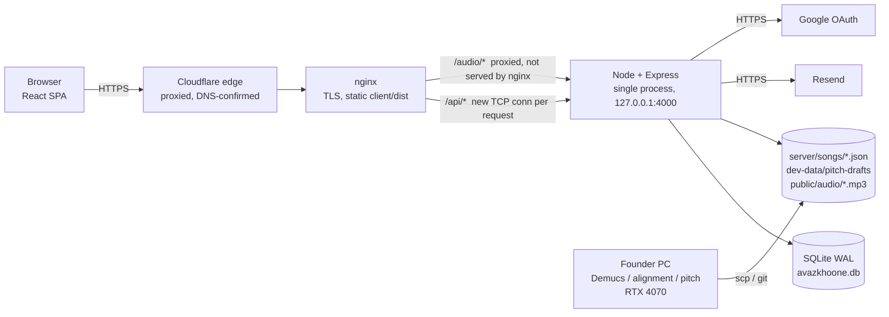

# Avaz Khoneh (آوازخونه) — Full System Audit and Capacity Report

| | |
|---|---|
| **Report date** | 2026-09-12 |
| **Code audited** | `am-amani/avaz-khoneh`, branch `main`, commit `ab4c751` ("fix(stage): the settings menu stops covering its own gear…", 2026-09-12 10:08 CEST) |
| **Production target** | https://avazkhoneh.com — DigitalOcean droplet, Ubuntu 24.04, nginx + Node 22 + SQLite (per `docs/DEPLOY.md`) |
| **Audit environment** | Remote sandbox (4 vCPU Xeon @ 2.8 GHz, 16 GB RAM), Node 22.22, Chromium 1194 (headless), no GPU, no Python pipeline |
| **Method** | Full read of server and client source; 305 server + 143 client automated tests; an isolated instance with six synthesized songs exercised through 108 API checks, 20 job-lifecycle / crash checks, 59 browser captures with axe-core scans; a load matrix of 17 runs against a production-mode instance pinned to one CPU core |
| **Revision** | 1.1, same day — production reachability re-checked at the founder's request; DNS evidence added (§3.4); S-1 / B-27 upgraded from conditional to confirmed; B-33 added |

> **Read this first — what this report could and could not verify.**
> 1. **Production was unreachable over HTTP from the audit sandbox, and this was re-checked at the founder's request after the first edition — same result.** The sandbox's egress proxy denies `avazkhoneh.com` (a 403 policy denial on the HTTPS CONNECT and on plain HTTP), the WebFetch tool reports `EGRESS_BLOCKED` for the domain, and the sandbox has no `ssh` binary. DNS resolution does work, and it settled one question: the domain resolves to Cloudflare anycast addresses, so the zone is proxied (§3.4). A single direct TCP probe outside the proxy reached Cloudflare's edge and got HTTP 403 for a plain `curl`; it was not repeated, because the environment's network policy denies the host and this audit does not route around policy. Every other statement about production is derived from the repository (deployment runbook, systemd unit, nginx site file, commit history, the SEO monitor's live-check logs of 2026-09-11/12 and the overnight reports in `docs/reports/`), is marked **[unverified on the box]**, and comes with the exact command to confirm it (Appendix B). To let a future session verify production directly, add `avazkhoneh.com` to the environment's allowed domains (Claude Code on the web → environment → network policy; see https://code.claude.com/docs/en/claude-code-on-the-web).
> 2. **The commit running on production cannot be confirmed.** The last documented deploy is `91acbfd` (2026-09-11, confirmed live by the SEO check at 2026-09-12 00:27 CEST). Sixteen commits have landed since, including the owner's Studio, the stage settings menu and the new avatars. Whether they are deployed is unknown.
> 3. **Load numbers are measured on the sandbox, not on the droplet.** The API was run in production mode pinned to a single Xeon core with the systemd default file-descriptor limit, so results are comparable to a 1-vCPU machine in shape, but a DigitalOcean Basic shared vCPU is slower. Every capacity figure states the derating assumption used. **Measured** and **Estimated** are labelled separately throughout.
> 4. **The audio pipeline (Demucs, alignment, pitch) was faked**, because the sandbox has no GPU and no `.venv`. Job state transitions, failure handling and crash recovery were tested against the fake; the real models' timings are quoted from the repository's own benchmarks.

## Table of contents

1. Executive Summary
2. Current Architecture
3. Local vs Production
4. Functional Audit
5. UI/UX Audit
6. Code / Architecture Audit
7. Security Audit
8. Reliability / Failure Analysis
9. Performance Measurements
10. Benchmark Methodology
11. Benchmark Results
12. Current Capacity
13. Bottlenecks
14. Scaling Thresholds
15. Scaling Strategy
16. Monitoring & Alerting Recommendations
17. Bugs Found
18. Technical Debt
19. Recommendations
20. Next Development Steps

Appendix A — Test inventory and raw evidence · Appendix B — Commands to verify on the box

---

## 1. Executive Summary

**Overall health: a well-built, fast-moving young product (165 commits in 12 days) that is functionally sound for its current small audience, with three data-loss paths and a handful of configuration ceilings that should be closed before it grows.**

**What was verified.** All 305 server tests and 143 client tests pass. On an isolated copy of the system, 108 API checks, 20 job/crash checks, 59 browser captures, the repository's own end-to-end scored karaoke run, and a 17-run load matrix on a single CPU core all ran. Production itself could not be reached over HTTP from the audit sandbox (network policy, no SSH), on the first attempt or on the re-check; DNS did resolve and confirms Cloudflare in front (§3.4). Every other production statement is marked and comes with a one-line command to confirm it on the box.

**Most serious problems (fix this week):**

1. **Two editors saving the same song silently overwrite each other, and the undo snapshots coalesce within 2 minutes regardless of author** — measured. Hand-timed work can vanish without a trace (B-1).
2. **Permanent delete works on live songs**: one call destroys the audio, lyrics, comments and snapshots of a song that is not in the trash and leaves a zombie catalogue row — measured (B-2).
3. **Production-only data is unprotected**: lyric edits made on the live server exist only on that disk inside a git working tree (one live song is not in git at all), the SQLite database and its backups share the same disk, and audio is never backed up server-side (B-3, S-14).
4. **Two capacity ceilings in configuration, not code**: the service runs with 1,024 file descriptors, so ~500 simultaneous song downloads start failing (measured: 6.6 % errors at 600 streams), and nginx proxies every audio byte through Node instead of serving files itself (B-32, C-1).
5. **Cloudflare proxies the domain (confirmed by DNS on the re-check), and neither the repository's nginx config nor the API restores the real client IP, so the login/register rate limiter keys on Cloudflare's edge IPs** and will lock innocent users out as traffic grows (S-1). The only remaining escape is a live nginx that differs from the repository — one `grep` on the box settles it (Appendix B).

**Current estimated safe capacity (today's 1 vCPU / 1 GB droplet, before the fixes):** roughly **1,200–1,500 concurrent active users** of a realistic mix (browsing, singing, commenting, editing) with sub-20 ms API latency; degradation at ~2,500–3,000; **~400–500 simultaneous "press play" is where users first see errors**; **~3 sign-ins per second** saturates the CPU (bcrypt in JavaScript); ~150 people singing all day exhaust the 1 TB monthly transfer allowance. Registered users and daily actives are not the constraint — bandwidth cost and simultaneous spikes are.

**First bottleneck under growth:** a simultaneous-play spike hitting the file-descriptor and nginx connection limits, followed by outbound bandwidth cost; for a sign-up wave, bcrypt CPU.

**Is production safe and stable today?** For its current traffic, yes: crash recovery, job-state recovery, SQLite durability, log redaction, authorization and CSRF/XSS posture all checked out. It is **not yet safe against operator mistakes and machine loss** (items 1–3), and item 5 is now a confirmed High as far as it can be seen from outside (Cloudflare in front, no real-IP handling in the repository), fixable with a few nginx lines (§19).

**Five most important next actions:**
1. Apply the one-line infrastructure fixes: `LimitNOFILE=65536`, serve `/audio` from nginx with cache headers, nginx `worker_connections`, real client IP behind Cloudflare, commit hash in `/api/health`.
2. Guard permanent delete (trash-only, owner-only) and add a version check to lyric saves (409 on conflict; never coalesce snapshots across users).
3. Nightly off-site backup of the database, lyric/draft documents and audio to Spaces; test one restore; stop treating the server's `server/songs` as a git checkout.
4. External uptime + disk + CPU alerts (free tiers) and a deep health endpoint.
5. Ship the v4 stage to everyone and delete the classic player; fix the phone settings-menu position, the 401 handling and the English error strings that public users currently see.


## 2. Current Architecture

### 2.1 Components

| Layer | What runs | Where it runs | Notes |
|---|---|---|---|
| Web client | React 18 + Vite 5 + Tailwind, single JS bundle (653 KB minified / 195 KB gzip), prerendered HTML per public URL (`tools/seo/prerender.mjs`) | Built on the droplet (`npm run build`), served by nginx from `client/dist` | No route-level code splitting; the login page ships the whole app (editor, studio, both players) |
| API | Node 22 + Express 4, single process, `node:sqlite` (synchronous), pino logging, helmet, express-rate-limit | Droplet, systemd unit `avazkhoneh.service`, bound to 127.0.0.1:4000 | One event loop does everything: auth (bcryptjs in pure JS), catalogue, comments, analytics, **and streaming every audio file** (`express.static` on `/audio`) |
| Reverse proxy / TLS | nginx (Ubuntu package), certbot | Droplet | Proxies `/api/` and `/audio/` to Node; serves static build; `client_max_body_size 150M` |
| Edge | Cloudflare, proxied zone (**confirmed by DNS**, §3.4) | Cloudflare anycast | `avazkhoneh.com` resolves to Cloudflare addresses, so every visitor's request reaches nginx from a Cloudflare edge; the live `robots.txt` also carries Cloudflare's managed AI-crawler blocks |
| Database | SQLite file `server/data/avazkhoone.db`, WAL mode, schema created/migrated on boot with `CREATE TABLE IF NOT EXISTS` + `ALTER TABLE` checks | Droplet disk | 15 tables; indexes on the hot paths (plays, scores, comments, reports) |
| Loose-file state | Lyric documents `server/songs/*.json` (tracked in git), pitch drafts `server/dev-data/pitch-drafts/*.json` (git), audio `server/public/audio/*` (**not** in git), F0 caches, uploads | Droplet disk + founder's machine | The catalogue's truth is split between SQLite (status, approvals, licence) and JSON files (words, timings) |
| Audio processing pipeline | Python: Demucs (htdemucs), torchaudio MMS forced alignment, faster-whisper (fallback), SwiftF0/RMVPE pitch, ffmpeg | **Founder's Windows PC with an RTX 4070 only.** Not installed on the droplet by design (`docs/DEPLOY.md`) | Production answers 503 to uploads; finished files are copied up with scp/rsync |
| Email | Resend API (verification, reset, contact, weekly digest) | External | Fire-and-forget for verification/reset; awaited for contact |
| Backups | `server/scripts/backup-db.js`: `VACUUM INTO` + copies of lyric/draft JSON, 14-day retention of backups and logs | Droplet disk, cron **[unverified on the box]** | Same disk as the database; audio is never backed up on the server side |
| Monitoring | Owner's Studio (`/studio`): in-memory 60-minute request buckets, event-loop delay histogram, process/OS stats, log tail | Inside the API process | Nothing external; no alerting; state lost on restart |

### 2.2 Request flow



### 2.3 Where the CPU-heavy work is

| Work | Cost | Runs on |
|---|---|---|
| Pitch detection, scoring, lyric animation, pitch ribbon | ~1 M multiply-adds per mic read at 20 Hz per singer; DOM writes at frame rate | **The singer's device** — the server never sees audio |
| bcrypt (cost 12, pure JS `bcryptjs`) | ~250–320 ms of API CPU per login/register (measured, see §9) | API event loop (chunked, but the CPU is still spent) |
| Audio streaming | ~10–13 MB per karaoke session through Node (`express.static`), then through nginx's proxy buffers | API + nginx + disk |
| Song import (Demucs 12 s on GPU / 3–6 min on CPU; alignment 14 s / 2–6 min; RMVPE 12 s) | GBs of RAM | Founder PC only |
| Analytics/Studio SQL | Full scans of `plays`/`scores`/`users` per 30–60 s cache window | API event loop (blocking, synchronous SQLite) |

### 2.4 Code size and test coverage (measured)

| Area | Lines | Tests |
|---|---|---|
| `server/src` | 6,104 | 305 tests in 29 files, all passing (`npm test`, 25 s) |
| `server/test` | 4,014 | — |
| `client/src` | 22,042 (1,528 of them tests) | 143 tests in 15 files, all passing (`node --test`), **but no `test` script is wired in `client/package.json`** |
| `tools/*.py` | 963 | Pipeline scripts; benchmarks in `docs/research` |
| Largest files | `LyricsEditor.jsx` 1,903 · `Player.jsx` 1,650 · `PlayerClassic.jsx` 1,103 (frozen copy) · `dev.js` 1,257 | |
| History | 165 commits since 2026-09-01 (152 in the last 7 days) — a two-week-old codebase moving very fast | |

### 2.5 Roles and gates (as implemented)

| Role | Client gate | Server gate |
|---|---|---|
| Anonymous | `/`, `/login`, `/register`, `/privacy`, password/verify pages | `/api/songs*`, comments GET, leaderboard, contact, health |
| User (verified email required by the **client** for every app page) | `/app`, `/songs`, `/artists`, `/sing/:id` (classic player), `/help`, `/settings`, `/mic-check` | comments/scores/reports POST require `requireVerifiedEmail`; **plays and client events do not** |
| Song manager | + `/dev/*` (desk, editor, pitch review, import, trash, playback settings, guides, release notes); the v4 stage with scoring | `/api/dev/*`, `/api/guide`, `/api/releases`, report queue (song categories) |
| Owner | + `/studio/*`, `/dev/analytics`, account deletion | `/api/studio/*`, `/api/analytics/*`, `/api/accounts/*`, all report categories |

Two launch flags decide what the public sees: `VITE_SCORING_ENABLED` (unset → scoring hidden behind "به‌زودی" for users) and `VITE_STAGE_V4` (unset → users get the frozen `PlayerClassic`, managers get the new stage).


## 3. Local vs Production

### 3.1 Which version is running on production?

**Cannot be confirmed from this audit** (production unreachable, no SSH). Evidence in the repository:

| Evidence | Says |
|---|---|
| `docs/reports/overnight-health-2026-09-10.html` | "Live commit: 46ccc26" on 2026-09-10 04:30 CEST |
| `docs/reports/seo/log.md` | Deploy of `91acbfd` on 2026-09-11; live check on 2026-09-12 00:27 CEST reports 0 failures, 21 songs, 44 sitemap URLs |
| `git rev-list 91acbfd..HEAD` | **16 commits since the last documented deploy**, all on 2026-09-11/12: the owner's Studio (`fa3f907`, `37d3507`), the stage control bar and settings menu (`ec63724`, `4e89927`, `8ba30cc`, `ab4c751`), cut-paper avatars (`a111516`), the VBR seek fix (`e5d17da`), the browser-check fixes |

The app exposes no build or commit identifier (`/api/health` returns `{ok:true}` only; `/api/studio/system` exposes the Node version but not the git revision). **Recommendation (Now):** stamp the build with the commit hash (`VITE_COMMIT` at build time and `process.env.COMMIT` in the unit file) and return it from `/api/health`, so this question can be answered in one request.

To confirm on the box: `cd /var/www/avazkhoneh && git rev-parse --short HEAD && git status --porcelain && systemctl show avazkhoneh -p ActiveEnterTimestamp`.

### 3.2 Differences that change behaviour

| Area | Local (founder machine / dev) | Production (droplet) | Risk |
|---|---|---|---|
| Song catalogue | 20 lyric documents in git | **21 songs live** (`omid-baran-2` exists only on production, never committed) | Git and the live catalogue have diverged; a redeploy that resets the working tree would delete a live song's lyrics. Commit history shows this has happened repeatedly (`f5fb35b` "commit the three lyric documents only production had", `1ab9c9e` "commit eight hand-timed songs that existed only on one machine") |
| Lyric edits | Written to `server/songs/*.json` by the editor | Same files, on the droplet, **inside a git working tree that `git pull` also writes** | `git pull` refuses when a tracked file is dirty (deploy blocked) or, with `checkout --`/`stash`, silently drops production edits. See F-3 |
| Database | Dev SQLite with test data | Production SQLite with real users, approvals (`timing_source`, `timing_reviewed_by`), licence status, difficulty overrides, comments, reports | None of the human decisions in the production DB exist anywhere else; backups stay on the same disk |
| Audio | Origin files on the founder's PC; stems produced there | Copied up by scp | The server never backs up audio; the founder's PC is the only origin |
| Audio pipeline | Present (`.venv`, CUDA) | Absent: uploads return 503, lyric saves return `pitchSync: "unavailable"` | A manager editing on production can never rebuild pitch; the song sits `pitch_stale` until the founder re-runs it locally and copies the draft |
| `NODE_ENV` | `development` (loopback CORS allowed, cookies not `Secure`) | `production` (`Secure` cookies) | Fine |
| Rate limiter identity | `req.ip` = the client | `trust proxy 1` behind nginx → the connecting IP as seen by nginx — **which is Cloudflare's, because the zone is proxied (§3.4)** | See S-1 |
| Client flags | `VITE_STAGE_V4`/`VITE_SCORING_ENABLED` unset | Same (per `docs/DEPLOY.md`) | Managers test one player, users get another; the frozen `PlayerClassic` is what the public actually uses |
| nginx config | `deploy/nginx.conf` (no TLS block) | Certbot-edited live file (TLS added) | Documented ("edit the live file, never copy this one over it"); the repo copy is no longer the source of truth |
| Node version | README assumes Node 24 locally | Node 22 (nodesource) | `node:sqlite` is experimental in both; behaviour identical in tests |
| Environment file | `server/.env.example` lists 6 keys | Server reads **19** keys; 13 are undocumented in the example: `ASSET_ROOT BIND_HOST CONTACT_EMAIL DB_PATH EMAIL_FROM GOOGLE_CLIENT_ID GOOGLE_CLIENT_SECRET LOGS_DIR LOG_LEVEL OWNER_EMAILS PYTHON_PATH RESEND_API_KEY SERVER_ORIGIN` | A fresh deploy from the example is incomplete (no email, no OAuth callback origin) |
| Docs | `docs/DEPLOY.md` env table says `EMAIL_FROM=…@avazkhoone.com` (typo) | Live value is `@avazkhoneh.com` per `FUTURE_WORK.md` | Documentation drift |

### 3.3 Deployment process risks found in the runbook

1. **`npm run build` on the droplet runs the prerender, which opens the production database.** `tools/seo/prerender.mjs` imports `server/src/routes/songs.js` → `db.js`, which opens `server/data/avazkhoone.db`, runs the boot migrations and the "mark unfinished jobs failed" UPDATE. The runbook runs the client build as root (no `sudo -u avazkhoneh`). A root-owned `-wal`/`-shm` pair left behind makes the service's next write fail with "attempt to write a readonly database". **[unverified on the box]** — check `ls -l /var/www/avazkhoneh/server/data/`. Fix: run the build as the service user or build the client elsewhere and rsync `dist`.
2. **No migrations with versions.** Schema changes are `ALTER TABLE` guarded by `PRAGMA table_info`; there is no way to roll back or to know which schema a backup has. Acceptable at this size, tracked in `FUTURE_WORK.md`.
3. **Deploy = `git pull` + `npm ci` + `npm run build` + `systemctl restart`**, by hand, with no health check afterwards and no rollback step. The unit restarts on failure, but a bad build simply serves a broken page.
4. **Backups exist only if the cron line was added** (`0 3 * * * … backup-db.js`). The Studio shows "آخرین پشتیبان: هرگز" when none exist — the owner should check that page once. **[unverified on the box]**

### 3.4 Is Cloudflare in front? — Yes (confirmed by DNS on the re-check)

The first edition inferred it from the live `robots.txt` recorded on 2026-09-12 (`docs/reports/seo/2026-09-12.json`), which carries nine `Disallow: /` entries beyond the app's own five — Cloudflare's *managed robots.txt*, injected only on proxied zones. On the re-check the sandbox's resolver answered directly (DNS lookups are not subject to the HTTP egress policy):

| Record | Answer | Owner of the address |
|---|---|---|
| `A avazkhoneh.com` | `104.21.37.187`, `172.67.212.104` | Cloudflare (`104.16.0.0/13`, `172.64.0.0/13`) |
| `AAAA avazkhoneh.com` | `2606:4700:3030::ac43:d468`, `2606:4700:3037::6815:25bb` | Cloudflare (`2606:4700::/32`) |

A DNS-only ("grey cloud") record returns the droplet's own address; Cloudflare anycast addresses are returned only for proxied ("orange cloud") records. **The zone is proxied — confirmed.** A single direct probe from the sandbox (a datacenter IP, plain `curl`, no browser headers) was then answered with HTTP 403 by the Cloudflare edge, which is how Bot Fight Mode or a WAF rule behaves; it was not investigated further (see the note at the top of this report).

What follows from Cloudflare being in front:

1. **The API's rate limiters key on Cloudflare edge IPs — S-1 is now High, not conditional.** `deploy/nginx.conf` has no `set_real_ip_from` / `real_ip_header` lines, so nginx appends the edge IP to `X-Forwarded-For`, and `trust proxy 1` in `index.js:48` makes Express take that last hop as `req.ip`. Only a live nginx that differs from the repository would change this; `grep -r real_ip /etc/nginx/` on the box settles it.
2. **Node's logs and the abuse trail record edge IPs, not visitors** — same cause, same fix.
3. **Audio is not cached at the edge today.** Cloudflare's default cache stores common static extensions (MP3 is on its documented default list) only when the origin's `Cache-Control` allows it, and its documentation says it does not cache `max-age=0` — which is exactly what `express.static` sends for `/audio` (C-1). Every play therefore comes from the droplet through Node. A positive `max-age` (§19 item 1) would move most audio bytes to Cloudflare at no cost; confirm afterwards with `curl -sI …/audio/<file>.mp3 | grep -i cf-cache-status` (expect `HIT` on the second request).
4. **Uploads above 100 MB fail at the edge, not in the app.** Cloudflare's request-body limit on the Free and Pro plans is 100 MB; the app and nginx allow 150 MB (`routes/dev.js:69`, `deploy/nginx.conf:36`). Today's songs are 6–13 MB, so this is a documentation mismatch rather than a live problem (B-33).
5. **Requests are capped at ~100 s** by Cloudflare's origin-response timeout (error 524). No request in the app is synchronous for that long — the upload returns after the copy and the job runs in the background — so nothing is affected today; remember it before adding any synchronous processing endpoint.
6. **External monitors and scripts from cloud IPs may be blocked** the way the audit's probe was. When adding an uptime checker (§16), allow it in Cloudflare (most well-known checkers are on Cloudflare's verified-bot list; a custom checker needs a WAF skip rule).

Still unverified on the box: the Cloudflare plan and its cache, WAF and SSL-mode settings; whether the origin's ports 80/443 are restricted to Cloudflare's ranges; and whether the live nginx matches the repository.


## 4. Functional Audit

Method: an isolated instance (fresh SQLite, six songs with synthesized audio and their real lyric/pitch documents, seeded owner / manager / user / unverified accounts) was exercised with 108 scripted API checks and 59 browser captures, plus the repository's own end-to-end `scored-run` browser check with a fake microphone. Everything below is **measured** unless marked otherwise. Raw results: `fn-results.json`, `job-results*.json`, `ui/report.json` (Appendix A).

### 4.1 Authentication, registration, verification, sessions

| Flow | Result | Evidence |
|---|---|---|
| Register: invalid email / short password / banned display name (`f*ck`) / duplicate email (case-insensitive) / client-supplied `role` | All rejected correctly (400 / 400 / 400 / 409 / role ignored) | AUTH-01…05 |
| Login wrong password vs unknown email | Same generic 401 message (no enumeration) | AUTH-10/11 |
| Forgot-password known vs unknown email | Identical 200 response | AUTH-20 |
| Session cookie | `HttpOnly; SameSite=Lax; Max-Age=30d`, `Secure` in production | AUTH-13 |
| Tampered JWT / `alg=none` JWT | 401 / 401 | AUTH-15/16 |
| Logout | Clears the cookie; **the old JWT keeps working for the rest of its 30 days** | AUTH-17/18 |
| Password reset | Works and marks the email verified; **does not invalidate existing sessions** | AUTH-19 (B-5) |
| Email verification | Link idempotent, 24 h TTL, resend with 60 s per-account cooldown | server tests `verification.test.js` (pass) |
| Google OAuth | Code reviewed only (no credentials in the sandbox): state cookie scoped to the callback path, verified-email-only account linking, unusable password hash for social accounts, `www` → apex redirect fixes the state-cookie split | `server/test/oauth.test.js` (pass) |
| Brute force | 10 attempts / 15 min / IP then 429; register shares the same bucket; contact 5 / 15 min | RL-01…05 |
| **Unverified account** | The client blocks **every** app page behind the verification gate (`ProtectedRoute`); the server only blocks comments, scores and reports. `POST /api/plays` and `/api/events` are open to unverified accounts | ROLE table, PLAY-01 |

Observations: the gate contradicts the written decision in `docs/FUTURE_WORK.md` ("don't hard-block any action on it for launch"). An unverified user whose email never arrives (Resend outage, spam folder, typo) can do nothing except press "resend"; there is no way to correct a mistyped address from the gate (U-2).

### 4.2 Roles and permissions (measured matrix)

| Endpoint | anon | unverified | user | song_manager | owner |
|---|---|---|---|---|---|
| `GET /api/dev/songs`, `/api/dev/dashboard`, `/api/dev/songs/deleted`, `PATCH /api/dev/playback-settings` | 401 | 403 | 403 | 200 | 200 |
| `GET /api/reports`, `/api/releases`, `/api/guide/:id/state` | 401 | 403 | 403 | 200 | 200 |
| `GET /api/studio/*`, `/api/analytics*`, `/api/accounts/*` | 401 | 403 | 403 | 403 | 200 |
| Manager closes an owner-category report | — | — | — | 403 | 200 |
| Manager sees owner-only report categories | — | — | — | filtered out | all |

No privilege-escalation path was found: the role is re-read from the database on every request, so a demotion takes effect immediately even though the JWT still carries the old role.

### 4.3 Songs, catalogue, audio

| Check | Result |
|---|---|
| Catalogue lists only songs whose lyric file **and** master audio exist on the machine | ✔ (6 of 20 in the sandbox; the 14 without audio are `audio_missing` and hidden) |
| Song payload | 42 lines / 204 words / 13 KB for a 6:46 song; `lyricLines` capped at 9 words per line |
| Unknown song, hidden song | 404 / 404 |
| Audio | Served **without authentication**, supports `Range` (206), `Cache-Control: public, max-age=0`, ETag |
| Path traversal on `/audio` (plain and percent-encoded) | Blocked (404) |
| Catalogue cache | 30 s TTL, not invalidated on writes: a new song, a deletion or an approval takes up to 30 s to appear (EDT-09, JOB-14) |

### 4.4 Comments, reports, scores, plays, events

| Check | Result |
|---|---|
| Comment: unverified user / unknown song / > 1000 chars / Persian profanity with separators (`ک.ی.ر`), repeated letters (`کییییر`), inflection (`کیرم`), `sh!t`, `f u c k` | 403 / 404 / 400 / all blocked |
| Comment: Latin transliteration of Persian profanity (`kir`, `k.i.r`) | **Accepted** (not in the list; "Finglish" is common in this audience) — B-23 |
| Comment: delete own / other's (user) / other's (manager) | 204 / 403 / 204 |
| Reports: submit / duplicate within 24 h / 6th in an hour / manager scope / owner close | 201 / 409 / 429 / correct / 200 |
| Scores: unverified / > 10000 / valid | 403 / 400 / 201 with rating tier |
| Scores and plays accept **any** `songId` and any score value; `POST /api/plays` has **no rate limit** | 40 junk plays created in seconds by one account; they then appear in the owner's Studio "top songs" (screenshot `studio--owner--phone.png`) — B-24 |
| Play progress | Clamped 0–100, completion stamped; another user's play → 404 |
| Client events | Kinds whitelisted; `search_miss` stores raw text (≤120 chars), rendered safely by React |

### 4.5 Song manager: editor, versions, approval

| Check | Result |
|---|---|
| Load source, save with overlapping words, save valid, invalid section | 200 / 400 / 200 / 400 |
| Save marks timing `draft` (never auto-approves); approve marks `human` with reviewer id; a later word save drops it back to `draft` | ✔ EDT-05/10/12 |
| Snapshots | First save creates slot 1; **a second save within 2 minutes is coalesced and the intermediate version is never kept** (EDT-07) |
| Restore | Writes the slot back (EDT-13); **does not reset the approval state** (EDT-14); the pre-restore document is itself coalesced away if the last save was < 2 min ago (agent finding B7) |
| Word-level save | Stale `expectedWord` → 409 (good) |
| Payload limit | Express JSON limit is 100 KB; the largest catalogue song saves at 32 KB with 500-char notes on every line, so there is headroom today |
| **Two editors on one song** | Manager saves line 3, owner saves line 6 seconds later: **owner's document overwrites the manager's line silently (200/200), and the snapshot table holds neither intermediate version** (CONC-01/02) — B-1 |
| Pitch draft after a timing edit | Reported outdated (409) until rebuilt — correct |
| Save on the production server (no pipeline) | 200 with `pitchSync: "unavailable"` and a Persian explanation — correct |

### 4.6 Song import and processing jobs (fake pipeline)

| Check | Result |
|---|---|
| Upload without the pipeline (= production) | 503 before the file is read — correct |
| Upload with the pipeline: queued → separating → aligning → complete; stems, guide vocal and isolated WAV written; song `lyrics_ready` | ✔ JOB-02…08 |
| Second upload / lyric save / delete while a job runs | 409 / 409 / 409 — one global job at a time |
| Save lyrics → pitch job → `ready` with draft; approve during the job → 409; approve after → `human` | ✔ JOB-09…13 |
| New song visible to the public after the 30 s cache | ✔ JOB-14 |
| Same title twice | Collision-safe id (`…-2`) |
| Wrong extension / garbage bytes with `.mp3` | 400 / **accepted** (extension-only validation; real Demucs would fail later, after the row was created) |
| Separation failure | Job `failed`, song `failed`, generated files removed — clean |
| Re-upload after a failure | Creates a new id; the failed row stays on the desk — acceptable but noisy |

### 4.7 Trash and permanent deletion

| Check | Result |
|---|---|
| Soft delete hides the song everywhere; restore brings it back; restoring a live song → 404 | ✔ |
| **`DELETE /api/dev/songs/:id/permanent` on a song that is NOT in the trash** | **Deletes all four audio files, the lyric document, comments and snapshots, but leaves the catalogue row (`status=ready`, `deleted_at=NULL`)** — a zombie song that the manager desk still lists (DEL-01) — B-2 |

### 4.8 Studio, analytics, logs, backups

| Check | Result |
|---|---|
| Studio endpoints (overview, content, system, logs, analytics, desk, gap report) | All owner-only, 1–12 ms on the sandbox dataset, 1.7–13 KB payloads |
| Log redaction | No session token anywhere in 285 KB of request logs; cookie header shows `[Redacted]` (the 2026-09-10 leak is fixed) |
| Backup script | Produces a `VACUUM INTO` snapshot plus dated copies of lyric and draft JSON and prunes > 14 days (BACKUP-01/02) |
| Health endpoint | `{ok:true}` with no database, disk or backup-age check |
| Unknown API route | Express's default HTML "Cannot GET" page instead of JSON |

### 4.9 Karaoke player, end to end (browser)

| Check | Result |
|---|---|
| Classic player (public users) and v4 stage (managers): load, press play, lyrics render, transport works, comments load | ✔ at phone / laptop / TV sizes; no horizontal overflow on any of 59 captures |
| Repository's own `scored-run` check (fake microphone, full 3:12 song, scored mode) | **Passes after two harness fixes**: it needs the first-visit tour dismissed and it still looks for an `<audio>` element that the app no longer creates. Result: live score accrued, `POST /api/plays` and `POST /api/scores` sent, zero page errors |
| Playback responsiveness on a phone viewport with 4× CPU throttling | 482 frames in 8 s, **0 frames over 34 ms**, p95 frame 16.7 ms — the "two clocks" design (20 Hz data tick, rAF visuals via refs) works |
| Refresh during playback | State is lost (SPA); the play row keeps the last progress via `pagehide` keepalive (by design) |
| Keyboard | Focus order on the stage: back → mute → volume → seek → restart → −5 s → play → +5 s → fullscreen → settings; focus rings visible (`stage-focus`). The settings menu's first item receives focus on open; **on phones closing it returns focus to a hidden button** (B-4) |
| Stage settings menu | Laptop: opens above the gear as designed. **Phone: opens at the top of the stage, over the header** (B-4, screenshot `stage-settings--owner--phone.png`) |
| First-visit tours (home and stage) | Modal overlays block the primary action until dismissed; shown once per account per device |


## 5. UI/UX Audit

Basis: 59 captures at 390×844 (phone), 768×1024 (tablet), 1440×900 (laptop) and 1920×1080 (TV) across every page for anonymous, unverified, user, manager and owner accounts; axe-core scans on 21 of them; the two delegated code reviews of the editor and the non-player pages. Screenshots are in the audit's `ui/` folder (not committed; re-runnable with `ui-pass.mjs`, Appendix A).

### 5.1 What is good

- Visual language is consistent: one dark palette, brand gradient for primary actions, gold for achievement, Pinar as the single self-hosted face with `font-display: swap`, RTL everywhere with numbers correctly isolated with `<bdi dir="ltr">` on the stage.
- Layout holds at every width tested; no horizontal scrolling anywhere; the TV layout is a real layout, not a scaled phone.
- Loading, empty, error and success states exist on most surfaces (catalogue, comments, reports dialog, verification gate, studio tiles with "fresh as of" stamps).
- The player's stage is genuinely well engineered for the singer: lyric type sizes itself to the room, the sung line never wraps beyond three rows, the settings float instead of pushing the words, the exit button is always on screen, and it stays at 60 fps under a 4× CPU slowdown.
- Persian copy is natural and specific; error messages from the server for singer-facing flows (reports, resend cooldown) are already Persian.

### 5.2 Bugs (UI)

| ID | Severity | Where | What happens | Evidence | Fix |
|---|---|---|---|---|---|
| U-B1 | Medium | Stage settings menu, phones (< 640 px) | Opens at the **top** of the stage over the title instead of just above the gear; closing returns focus to an invisible button | `AudioTransport.jsx:115,135` render the same `settingsButton` element twice with one `ref`; the hidden desktop copy wins, `getBoundingClientRect()` of a `display:none` element is 0, so `menuBottom = stageBottom + 8` (`Player.jsx:439-443`). Screenshot `stage-settings--owner--phone.png` vs laptop | Give each copy its own ref and pick the visible one (`offsetParent !== null`), or render one button and move it with CSS order |
| U-B2 | Medium | Settings page after a password login | Saving wipes date of birth and phone: the login response omits them (`auth.js:69-74`), Settings seeds its state from that object and sends `null` (`Settings.jsx:10-11,24`) | Code | Return `toProfile(row)` from login/register, or refresh `/auth/me` before rendering Settings |
| U-B3 | Medium | Studio system/song pages, MyScores on Safari | "NaN دقیقه پیش": `timeAgoFa` appends `Z` to timestamps that already end in `Z` (job rows are ISO), and `"YYYY-MM-DD HH:MM:SS Z"` is Invalid Date on Safari | `activityLabels.js:26` vs `dev.js:295,519`; the Safari-safe parser exists in `SongComments.jsx:8-10` | One shared parser |
| U-B4 | Medium | Any page after the JWT expires or the account is deleted | No 401 handling: pages print the raw English "Invalid or expired session", Studio keeps polling every 10 s | `api.js:12-19`, `AuthContext.jsx` | On 401 (except login) clear the user and route to `/login` |
| U-B5 | Medium | Verification gate | Any network error settles the gate and bounces the user to `/login`; polling ignores `document.hidden`; a mistyped email cannot be corrected from the gate | `VerifyEmailGate.jsx:43-51,68` | Settle only on 401; add an "edit email" field |
| U-B6 | Medium | Studio song page | Report category ids `playback`/`comment` show as raw English ids (client map lags the server's) | `StudioSong.jsx:17-22` vs `reports.js:14-20` | Use `categoryLabel` from the API |
| U-B7 | Medium | Phone navigation (< 1024 px) | The owner has no link to the Studio; `Navbar.jsx` keeps its own menu list and drifted from `navItems.js` | Code + screenshots | Navbar consumes `managerNavItems()` |
| U-B8 | Medium | Landing contact form | If Resend fails after the message is stored, the user sees "Internal server error" and resubmits → duplicates | `contact.js:40-43` | Catch mail errors, still answer `ok` |
| U-B9 | Low | Lyrics editor | Word-save response overwrites edits made while it was in flight; a full save marks later edits as clean; song switch does not cancel in-flight loads (a slow response can be saved under the wrong song); the "pitch stale" prompt is hidden once a job has completed | Delegated review, `LyricsEditor.jsx:659-682, 1113-1165, 293-344, 1546` | Functional-updater `setLines`, a `saving` flag, cancellation tokens |
| U-B10 | Low | Editor | Arrow-key nudges fire one PATCH per key with no debounce; auto-commit on drag release fires PATCHes the server must reject for unsaved lines | `WordTimeline.jsx:147,168` | Debounce, skip when the line is not on disk |
| U-B11 | Low | Mic check | The countdown `setInterval` is only cleared on the happy path; abandoning the check leaks a 1 Hz state update | `MicCheck.jsx:186-200` | Clear in `stopCheck` and on unmount |
| U-B12 | Low | Every page | Unknown URLs redirect silently to `/` (no 404 page) | `App.jsx:315` | A "page not found" route |

### 5.3 UX problems (works, but hurts)

| ID | Severity | Problem | Why it matters | Recommendation |
|---|---|---|---|---|
| U-X1 | High | **Email verification is a hard gate for everything**, including browsing and singing, and the app's own backlog records the opposite decision | Sign-up conversion depends entirely on Resend delivery and spam filters; with a wrong address the user is stuck | Gate only comments/scores/reports (as the server already does); keep the reminder banner |
| U-X2 | Medium | Two modal tours (home and stage) cover the primary action on first visit; the stage tour appears again on every device and blocks "پخش آهنگ" | First impression is an overlay to dismiss; it also broke the project's own automated check | Make tours dismissible by tapping outside, skip on the stage when a song was chosen via a deep link, or show once per account (server-side flag) |
| U-X3 | Medium | Raw English server messages on Persian screens: "Incorrect email or password", "An account with this email already exists", "Phone number is not valid", "Request failed with status 413/502", "Another song-processing job is currently running", "Word not found" | Breaks the otherwise careful Persian voice; some are the first thing a new user sees | Map `status`/`error` codes to Persian copy in `api.js` |
| U-X4 | Medium | Two players in production: the public gets the frozen `PlayerClassic` (controls collapse mid-song, scoring shows "به‌زودی", no settings menu, no fullscreen); managers test the new stage | Everything being polished is invisible to the audience it is for | Decide a date for `VITE_STAGE_V4=true` and delete the classic player |
| U-X5 | Medium | Editor: one status line overwritten by every edit; no busy state on Save / restore / repeat; `deleteWord` and "حذف کشش" have no confirmation while `deleteLine` does; restore menu has no Escape handling | Double clicks are cheap and destructive here | Busy flags, consistent confirmations, `aria-live` status |
| U-X6 | Medium | Editor affordances are hover-only (`opacity-0 group-hover:opacity-100` on insert-word and seam controls, drag-only line swap) | Invisible on touch, unreachable by keyboard | Always-visible small controls, keyboard equivalents |
| U-X7 | Medium | Studio: one failed poll blanks the whole dashboard although the previous data is still in state; no loading state on filter/range change | A blip reads as an outage | Inline "stale since…" banner over old data |
| U-X8 | Medium | Portaled menus (`NavMenu`, `BrandedSelect`) and dialogs (`Tour`, `ManagerWelcome`, `ReportDialog`) do not trap or restore focus; Tab order leaves the menu | Keyboard and TV-remote users lose their place | Focus trap + restore, arrow-key navigation |
| U-X9 | Low | Mixed digit systems: Persian digits on the stage clock and some tiles, Latin digits in "N روز پیش", BPM, sparklines, cohort labels; three date formats | Reads as unfinished | One `formatNumber`/`formatDate` helper |
| U-X10 | Low | `/scores` for a normal user silently redirects to `/app`; the nav still shows the trophy with "به‌زودی" | Confusing | Hide the item or show a "coming soon" page |
| U-X11 | Low | Manager desk lists every song without audio as a work item on a fresh checkout; the desk mixes "blocked by licence", "audio missing" and "difficulty unreviewed" in one queue | The queue is long and undifferentiated | Group by urgency; hide informational items behind a toggle |
| U-X12 | Low | Studio search only exists at ≥ 1024 px; `/studio` has no `<title>` and is indexable | Minor | Add the search field to the phone strip; add `noindex` head for `/studio` and `/dev` |

### 5.4 Visual inconsistencies

| ID | Observation | Evidence |
|---|---|---|
| U-V1 | `font-bold` is used 96 times but no 700-weight face is declared; the browser substitutes ExtraBold (800) while `Pinar-Bold.woff2` sits unused on disk | `index.css:5-35` |
| U-V2 | Same concept, different chrome: `Pill` (`StudioBits`) vs hand-rolled badges in `ReportQueue`, `Analytics`, `SongCard`, nav badges; `btn-primary/btn-ghost` vs bespoke bordered buttons | Delegated review |
| U-V3 | Colour literals duplicated outside the Tailwind tokens: `#181123`, `#160F28`, `#120B22`, sparkline gold `#E8C468` vs token `#DDC582`; two scrollbar palettes | `NavMenu`, `BrandedSelect`, `Tour`, `StudioLayout`, `Sparkline`, `index.css` vs `scrollbars.css` |
| U-V4 | Time formats: `en-GB` in logs, `fa-IR` in system tiles, "DD/MM" in charts, relative elsewhere | `StudioLogs.jsx:145`, `StudioSystem.jsx:214`, `Analytics.jsx:22` |
| U-V5 | `<span dir="ltr">` around Persian phrases ("۵ پخش", "اوج 12 ms") flips the arrow/number order in RTL text | `StudioOverview.jsx:89`, `Analytics.jsx:190-193`, `StudioSystem.jsx:117` |

### 5.5 Accessibility (axe-core, WCAG 2 A/AA + best practice, 21 pages)

| Rule | Impact | Pages | Nodes | Typical element |
|---|---|---|---|---|
| `region` — content outside landmarks | moderate | 21 | 290 | Whole layouts (no `<main>`/`<nav>` landmarks) |
| `svg-img-alt` | serious | 2 | 48 | Avatar picker faces (`button[aria-label="چهره مرد شماره 1"] > svg`) |
| `link-name` | serious | 9 | 40 | Song cards / artist tiles whose link text is an image or empty span |
| `landmark-one-main` | moderate | 13 | 13 | No `<main>` |
| `color-contrast` | serious | 6 | 7 | Dim tabular numbers (`.tabular-nums`), muted labels |
| `label` | **critical** | 2 | 4 | Login/register inputs with placeholder only |
| `button-name` | **critical** | 3 | 3 | `button[aria-haspopup="menu"]` (account menu) |
| `scrollable-region-focusable` | serious | 3 | 3 | `max-h-80` lists |
| `landmark-unique`, `image-redundant-alt`, `page-has-heading-one`, duplicate banner | minor/moderate | 1–4 | 1–4 | |

Keyboard: the stage is fully operable (measured focus order above); dialogs and portaled menus are not (no trap/restore, no arrow keys). Screen readers: the lyric box is `aria-live="polite"`, which will announce every line change — probably too chatty for a singer using a reader; consider `aria-live="off"` with a separate "now singing" region.

### 5.6 Mobile / tablet / TV specifics

- Phone (390 px): no overflow; the stage fits with the transport pinned; comments below the stage; the classic player shows a dense control row (sing mode + size + auto-skip + offset) above the lyrics that takes a third of the viewport before the words. The editor is usable but a 1,900-line page on a phone means long scrolling with small drag handles (44 px targets are respected).
- Tablet (768 px): identical to phone layout stretched; the side rail appears only at 1024 px, so tablets keep the top strip. Fine.
- TV (1920×1080): the v4 stage scales type with `vw`; the first-visit tour also appears on TV and must be dismissed with a remote. The TV capture of the playing state timed out on the play button behind the tour (harness), so the playing TV state was only verified through the laptop capture and the code.
- Bluetooth latency compensation (±1000 ms lyric offset per device) is a thoughtful touch; it is buried three levels deep in the settings menu.


## 6. Code / Architecture Audit

### 6.1 Overall assessment

The codebase is unusually well commented for its age: nearly every non-obvious decision carries a paragraph explaining what broke and why the code looks the way it does, the server has a real test suite that runs in isolated temp directories, and the client's hot paths (lyric wipe, pitch ribbon, mic reads) are deliberately kept out of React's render cycle. The main structural weaknesses are (a) two very large page components that own too much state, (b) a catalogue whose truth is split between SQLite and loose JSON files on two machines, and (c) a single Node process that also does the bandwidth-heavy work of streaming audio.

### 6.2 Findings

| ID | Severity | Area | Finding | Evidence | Recommendation | Priority |
|---|---|---|---|---|---|---|
| C-1 | High | Architecture | **Audio is streamed by Node through a proxy.** nginx proxies `/audio/` to Express, which reads each 6–13 MB file and writes it to nginx, which buffers it (default `proxy_buffering on`, temp files on disk for slow clients) before the client. Every play costs Node CPU, a file descriptor, memory and a disk temp-file write on the droplet | `deploy/nginx.conf:38-41`, `index.js:81`; measured: 100 concurrent karaoke sessions = 122 Mbit/s through one Node core (§11) | Serve `/audio/` directly from nginx (`alias /var/www/avazkhoneh/server/public/audio/; sendfile on;` + `Cache-Control`), then let Cloudflare cache it. Node keeps only JSON | Now |
| C-2 | High | Data model | **Catalogue truth is split** between the SQLite row (status, approval, licence, difficulty) and the lyric JSON file (words, timings), and the JSON lives in a git working tree on the production box | `songStore.js`, `dev.js:789-882`, drift evidence §3.2 | Move lyric documents into the database (one `lyric_documents` table with `version`, `updated_at`, `updated_by`), keep git for seed data only; or at minimum move `server/songs` out of the git tree and treat git as read-only on the server | Soon |
| C-3 | High | Concurrency | **No optimistic locking on lyric saves** (no version/etag), and snapshots coalesce on time alone (`saved_at` within 2 min, regardless of author) | `dev.js:789-846`, `lyricSnapshots.js:20-27`; CONC-01/02 | Send `updatedAt`/hash with `PUT`, return 409 on mismatch; never coalesce across users; keep N versions | Now |
| C-4 | Medium | Server | `permanentlyDeleteSong` does not require the song to be in the trash; the route calls it directly | `dev.js:150-154`, `songStore.js:238-250`; DEL-01 | Refuse unless `deleted_at IS NOT NULL` (one `WHERE`), and delete the row before the files | Now |
| C-5 | Medium | Server | Global one-job lock with no timeout, no cancellation, no process-group kill: a hung Demucs blocks every lyric save site-wide until a restart; a crashed API leaves the Python children running; a child finishing after the crash leaves `*.tmp.json` in `pitch-drafts` | HANG-01…04, CRASH-05, CRASH-13b | Job timeout (e.g. 30 min) with `child.kill('SIGKILL')` on the process group; a cancel endpoint; sweep `*.tmp.json` at boot | Soon |
| C-6 | Medium | Server | `uncaughtException`/`unhandledRejection` handlers log and **keep the process running**; systemd's `Restart=on-failure` never fires; no SIGTERM handler for graceful shutdown | `index.js:136-137`, `deploy/avazkhoneh.service` | Log, then `process.exit(1)`; handle SIGTERM: stop accepting, close the server, exit | Soon |
| C-7 | Medium | Server | Log "rotation" is decided once at boot (`logFile` computed from the boot date), so a long-running process writes weeks into one file; the 14-day prune keys on mtime and never touches a file still being written | `logger.js:11`; LOG-10 | Use `pino.destination` with a daily rotating stream (or `pino-roll`), or let journald own logs and drop the file stream | Soon |
| C-8 | Medium | Server | bcrypt in pure JS (`bcryptjs`, cost 12) on the event loop: ~250–320 ms of CPU per login/register (measured) | §9, `auth.js:140,166` | Move to native `bcrypt` or `argon2` in the libuv threadpool, or lower cost to 10 for a 4× saving | Soon |
| C-9 | Medium | Server | Catalogue cache is time-based (30 s) and not invalidated by writes; `GET /api/dev/songs` re-reads and re-parses every lyric and draft file on every request (5 file reads per song) | `songs.js:31-50`, `dev.js:81-123` | Invalidate on write; cache the manager list per mtime | Later |
| C-10 | Medium | Server | Studio/analytics queries are full scans of `plays`, `scores`, `users` executed synchronously on the event loop (`node:sqlite` is blocking); cached 30–60 s, so fine at 10⁴ rows, a problem at 10⁶ | `studio.js`, `analytics.js` | Pre-aggregate daily counters (a `daily_stats` table updated on write) before `plays` passes ~1 M rows | Later |
| C-11 | Medium | Server | nginx → Node uses a new TCP connection per request (`proxy_http_version 1.1` without `proxy_set_header Connection ""` and no `upstream keepalive`) | `deploy/nginx.conf:30-36`; measured 17 % CPU saving with keep-alive (§11) | `upstream api { server 127.0.0.1:4000; keepalive 32; }` + `proxy_set_header Connection "";` | Soon |
| C-12 | Medium | Client | `LyricsEditor.jsx` (1,903 lines, ~60 handlers, 720-line JSX) recomputes validation, timing problems, stretched words and a sort of the whole document on **every render**, and re-renders on every `timeupdate` and every drag `pointermove` | Delegated review P1/P2 | Memoise on `lines`; throttle drag updates with rAF; split the per-line card into a memoised component | Soon |
| C-13 | Medium | Client | Two full players (`Player.jsx` 1,650 + `PlayerClassic.jsx` 1,103 lines) share ~800 lines of identical logic by copy; bug fixes must be made twice or the public silently keeps the bug | Header of `PlayerClassic.jsx` documents this as temporary | Ship v4 to everyone and delete the copy | Soon |
| C-14 | Medium | Client | No route-level code splitting: `App.jsx` statically imports every page; the login page downloads the editor, the studio and both players (653 KB JS) | Bundle map §9 | `React.lazy` for `/dev/*`, `/studio/*` and the players | Soon |
| C-15 | Low | Client | Polling and job-tracking logic exists in four variants with different failure semantics (`usePolling`, `LyricsEditor`, `PitchReview`, `SongImportPanel`); one transient error marks a job failed forever in two of them | Delegated review D4/B11 | One hook with retry/backoff | Later |
| C-16 | Low | Client | Duplicated helpers: Persian-digit formatting (3 places + 2 server copies), relative time (2, only one Safari-safe), `fmtDay` (3), difficulty labels (2), nav item lists (2, drifted), report categories (2) | Delegated review | One `lib/format.js`, one nav source | Later |
| C-17 | Low | Client | 14 MB of font files ship in `public/fonts` (157 files: TTF, OTF, a `web test/` folder with jQuery) while 5 woff2 files are referenced; `public/benchmark` (376 KB) and two lab HTML pages are published too | `client/public` listing | Keep the 5 woff2 files; move labs and benchmark fixtures out of `public` | Later |
| C-18 | Low | Client | Unused code: `Vazirmatn` fallback declared but never loaded, `.brand-scrollbar` superseded, unreachable verification banners in `Dashboard`/`Settings` (the gate replaces them), `isUserFaceCode`, `STUDIO_ITEMS` | Delegated review | Delete | Later |
| C-19 | Low | Tests | Client tests are not runnable through `npm test` (no script), no CI runs either suite, the repo's own browser check needs manual patching (`channel: 'chrome'`, tour, `querySelector('audio')`) | `client/package.json`, `tools/browser-check/scored-run.mjs` | Add `"test": "node --test src/lib/*.test.*"`, a GitHub Action running both suites, and make the browser check use `executablePath` + pre-dismissed tours | Soon |
| C-20 | Low | Server | `express.json()` default 100 KB body limit; the largest catalogue save today is 32 KB; per-line notes and `parts` will grow it | EDT-02/15 | `express.json({ limit: '1mb' })` on the lyric routes | Later |
| C-21 | Low | Server | `POST /api/plays` and `/api/scores` accept any `songId` with no rate limit; junk rows pollute the owner's analytics | RL-06/07, Studio screenshot | Validate `songId` with `getSong`, add a per-account limiter | Soon |

### 6.3 Real-time path (player) — verdict

The stage's design holds up under measurement: pitch reads are paced at 20 Hz on a timer, all frame-rate work goes through refs and `translate3d`/`clip-path` writes, React state changes are limited to ~5 Hz (clock) plus word/line changes, and `PitchRibbon`, `TimedLyrics` and `SongComments` are memoised. Under a 4× CPU throttle on a phone viewport the stage rendered 482 frames in 8 s with none over 34 ms. Remaining risks: the autocorrelation is O(N·L) ≈ 1 M multiply-adds per read (fine for two singers, the comment says stride if six ever matter); `changeAudioMode` sets `currentTime` immediately after `load()`, which Safari may ignore before metadata arrives (suspected iOS-only resume-from-zero on mode switch); `Audio()` objects are dropped without `src=''`/`load()` on stop, so the browser may keep fetching a file after the singer left.

### 6.4 Database

| Topic | State |
|---|---|
| Engine | SQLite via `node:sqlite` (experimental API), WAL, `foreign_keys=ON`, single process |
| Indexes | Present on every query path that matters today (`plays(song_id, created_at, completed_at)`, `plays(user_id…)`, `scores(song_id)`, `scores(user_id)`, `comments(song_id…)`, `song_reports(status…)`, `activity_log`, `client_events(kind…)`) |
| Missing | No index on `users.verification_token_hash` / `reset_token_hash` (full scan per link click — trivial below 10⁵ users); no `busy_timeout` (irrelevant with one process) |
| Growth | ~200 B per play row, ~150 B per score row, ~300 B per comment (measured on the load DB, §9). 1 M plays ≈ 250 MB with indexes |
| N+1 | None on request paths; the manager desk does per-song file reads (C-9) |
| Migrations | Boot-time `ALTER TABLE` with `PRAGMA table_info` guards; no version table (tracked in `FUTURE_WORK.md`) |


## 7. Security Audit

No secrets are reproduced here. The sandbox could not inspect the production `.env`, nginx live config, TLS settings or Cloudflare settings; items marked **[verify]** need one command on the box (Appendix B).

### 7.1 What is done well (measured or read)

- Passwords: bcrypt cost 12; generic login errors; forgot-password does not enumerate; reset tokens are SHA-256 hashed at rest, single-use, 1-hour TTL; verification tokens hashed, 24-hour TTL.
- Sessions: signed JWT in an `HttpOnly; SameSite=Lax; Secure` cookie; `alg=none` and tampered tokens rejected; role re-read from the database per request.
- CSRF: `SameSite=Lax` + JSON-only bodies + a CORS allow-list that answers 403 to foreign origins (MISC-03) — cross-site POSTs cannot carry the cookie.
- Injection: every SQL statement is parameterised; the only interpolations are whitelisted table names and constants. No `dangerouslySetInnerHTML` with user data (the two uses draw avatars from numeric specs); JSON-LD is set via `textContent`.
- Uploads: multer with a 150 MB cap, one file, extension whitelist, temp dir outside the web root; the pipeline is absent on production, so the endpoint answers 503 before reading the body.
- Path handling: `resolveSongFile` and `removeSongFiles` refuse anything outside the asset root; `/audio` traversal blocked (SONG-07/08); the log reader accepts only `YYYY-MM-DD.log`.
- Logs: session cookies and `Authorization` are redacted (LOG-01) — the 2026-09-10 leak is closed.
- Network: the API binds to loopback (fixed 2026-09-10); helmet sets `nosniff`, `X-Frame-Options: SAMEORIGIN`, HSTS, `Referrer-Policy: no-referrer` on API responses.
- Moderation: a normalising profanity filter (Arabic/Persian letter folding, ZWNJ, leetspeak, separators, repeats) with word boundaries to avoid the Scunthorpe problem; applied to comments and display names.

### 7.2 Findings

| ID | Severity | Finding | Evidence | Impact | Recommendation | Priority |
|---|---|---|---|---|---|---|
| S-1 | **High** | **Cloudflare proxies the zone (DNS-confirmed, §3.4) and nothing restores the real client IP, so `trust proxy 1` makes `req.ip` the Cloudflare edge IP for every visitor.** The auth limiter (10 / 15 min), the contact limiter, the comment and event limiters share a handful of buckets across all users; the logs record edge IPs | `index.js:48`, `auth.js:34-41`; `deploy/nginx.conf` has no `set_real_ip_from` / `real_ip_header`; DNS → Cloudflare anycast; live `robots.txt` | As traffic grows, innocent users get "Too many attempts" on login and register (a site-wide lockout every time ten people mistype a password within 15 minutes behind the same edge), and abuse investigations have no client IPs | In nginx: `set_real_ip_from` for Cloudflare's published ranges + `real_ip_header CF-Connecting-IP`, keep `trust proxy 1` (or read `cf-connecting-ip` in a `keyGenerator`); restrict ports 80/443 to Cloudflare's ranges so the origin cannot be reached around the edge. **[verify on the box]** only that the live nginx has no real-IP lines either: `grep -r real_ip /etc/nginx/` | Now |
| S-2 | Medium | No server-side session revocation: logout and password reset leave issued JWTs valid for up to 30 days; a stolen cookie survives a password change | AUTH-18/19 | A compromised device stays logged in after the user "logs out everywhere" by changing the password | Add `users.token_version` (bump on reset/logout-all) and embed it in the JWT; or a `sessions` table | Soon |
| S-3 | Medium | Every audio asset, including the 30–70 MB analysis-grade `*-vocals-isolated.wav` stems, is publicly downloadable without authentication, referer check or rate limit | `index.js:81`, `assetPaths.js:46`, SONG-06 | Licensed masters and clean vocal stems are one URL away (licensing exposure); bandwidth abuse by hot-linking or scripted download | Move `-vocals-isolated.wav` out of `public/audio` (it is pipeline input, never played); when audio moves to nginx/CDN add `valid_referers`/signed URLs if the licence terms require it | Soon |
| S-4 | Medium | The HTML origin carries no security headers: nginx serves `index.html` and the prerendered pages without CSP, `X-Frame-Options`, `Referrer-Policy`, and HSTS depends on how certbot was run | `deploy/nginx.conf` has no `add_header`; helmet covers only `/api` and `/audio` | Clickjacking and XSS blast radius are unmitigated on the pages users actually see | `add_header Content-Security-Policy "default-src 'self'; img-src 'self' data:; media-src 'self'; font-src 'self'; connect-src 'self'"` (adjust for Google OAuth redirect), `X-Frame-Options DENY`, `Referrer-Policy strict-origin-when-cross-origin`, `Strict-Transport-Security` | Soon |
| S-5 | Medium | Upload validation is by file extension only; content is not sniffed (magic bytes) or probed (`ffprobe`) before it reaches Demucs/ffmpeg | `dev.js:58-74`, FAIL-02; already in `FUTURE_WORK.md` | A compromised manager account can feed crafted files to ffmpeg/PyTorch **on the founder's personal PC** | Magic-byte check + `ffprobe -v error` before spawning the pipeline; run the pipeline as a low-privilege user | Soon |
| S-6 | Medium | A song manager can permanently destroy a live song's files and comments with one API call (DEL-01); no confirmation token, no audit of what was removed beyond `song.purged` | `dev.js:150-154` | Insider mistake or compromised manager account causes irreversible data loss (audio exists only on the founder's PC) | Require the trash state; require owner role for permanent purge; keep a 24 h tombstone | Now |
| S-7 | Low | `POST /api/plays`, `/api/scores`, `/api/events` accept arbitrary `songId`/values with no per-account limit (events has an IP limit) | RL-06/07 | Storage and analytics pollution; a scripted client can create millions of rows | Validate `songId`; per-account limiter; server-side score validation before any public leaderboard (already planned) | Soon |
| S-8 | Low | Moderation misses Latin-transliterated Persian profanity (`kir`, `k.i.r`) | MOD tests | Common in this audience's comments | Add transliterated terms with `suffix:false` boundaries | Later |
| S-9 | Low | `qs` DoS advisories (moderate) via Express 4.22.2; `react-router-dom` 6 advisory (SSR-only, not applicable) | `npm audit` | Low exposure (bodies are JSON, query strings tiny) | Track; upgrade with Express 5 when convenient | Later |
| S-10 | Low | systemd unit has no hardening (`NoNewPrivileges`, `ProtectSystem=strict`, `PrivateTmp`, `ReadWritePaths`) and no `LimitNOFILE` | `deploy/avazkhoneh.service` | A compromised process has the whole filesystem; the fd limit is also a capacity limit (§13) | Add the four directives and `LimitNOFILE=65536` | Soon |
| S-11 | Low | OAuth `id_token` signature is not verified locally (relies on the TLS channel to Google's token endpoint) | `oauth.js:79-122` | Acceptable for the server-side code flow; becomes wrong if the flow ever changes to client-posted tokens | Leave, with the existing comment | — |
| S-12 | Low | Unknown API routes return Express's default HTML 404 | MISC-02 | Fingerprinting, inconsistent clients | A JSON 404 handler after the routers | Later |
| S-13 | Low | The verification hard-gate means an attacker who registers with someone else's email cannot do much — good — but the owner-deletion tool and `OWNER_EMAILS` promotion mean anyone who registers an email listed in `OWNER_EMAILS` before the owner does becomes owner without verifying it | `db.js:390`, `auth.js:139` | Only exploitable if the owner list contains an address not yet registered | Promote only verified accounts | Soon |
| S-14 | Info | Backups are on the same disk as the database; nothing off-site; audio never backed up server-side; retention 14 days | `backup-db.js` | Disk failure or a bad `rm` loses users, scores, approvals and lyrics at once | Nightly copy to DigitalOcean Spaces or any S3 (10-line script with `rclone`), test a restore once | Now |
| S-15 | Info | Logs hold emails, user ids, user agents and (edge) IPs for 14 days in JSON on disk; the privacy page discloses server logs | `logger.js` | Fine for GDPR-style disclosure; keep retention short | — | — |

### 7.3 Abuse scenarios considered

| Scenario | Today | Mitigation |
|---|---|---|
| Credential stuffing | 10/15 min per Cloudflare edge today (S-1), not per visitor; no account lockout | Fix S-1; add per-account soft lockout after 20 failures/hour |
| Comment spam | Verified email required, 20/10 min per IP, profanity filter, managers can delete | Adequate for launch |
| Report flooding | 5/hour per account, 20/hour per IP, duplicate suppression | Adequate |
| Contact-form spam | 5/15 min per IP, no CAPTCHA, each message triggers two emails | Add a honeypot field; cap emails per hour |
| Registration flooding | 10/15 min per IP; each registration sends an email via Resend | Site-wide today because of S-1; per-visitor once S-1 is fixed |
| Hot-linking / scraping audio | Nothing | S-3 |
| Fake scores | Client-trusted by design; scoring hidden from the public | Server-side validation before leaderboards |
| Malicious upload | Manager-only; extension check; pipeline on the founder's PC | S-5 |


## 8. Reliability / Failure Analysis

Each case was **simulated** on the isolated instance unless marked *code review*. "Recovers" means without a person.

| # | Failure | What happens | Recovers? | Data loss / corruption | Evidence |
|---|---|---|---|---|---|
| F-1 | Backend process crashes (SIGKILL) | systemd restarts it (`Restart=on-failure`, 3 s); SQLite WAL replays cleanly; in-flight requests fail | **Yes** (systemd) — but only for real crashes: after an `uncaughtException` the process **stays up in an unknown state** and systemd never restarts it | None observed | CRASH-03/04/11; `index.js:136-137` |
| F-2 | Backend unavailable to the browser (restart, 502) | API calls throw; pages show raw English messages or stay on stale data; the player keeps playing the already-loaded audio but cannot record plays/scores; the Studio blanks its dashboard | Manual page reload | A finished performance's score is lost if `POST /api/scores` fails (no retry queue) | Code review (`api.js`, `Player.jsx:857-862`) |
| F-3 | Database unavailable (locked, read-only, disk full) | `node:sqlite` throws synchronously → 500 on every DB route; audio and health still answer 200 (health does not touch the DB) | Manual | Writes lost; nothing corrupts (SQLite atomicity) | Code review; the root-owned WAL scenario in §3.3 is the most likely cause |
| F-4 | Disk full | pino stream write errors are swallowed; SQLite `SQLITE_FULL` → 500s; logs stop; backups fail | Manual | Writes lost while full | Code review; the 14-day log prune only runs inside the nightly backup job, which must be scheduled |
| F-5 | Slow network for a singer | `<audio>` stalls, `waiting` → "buffering" hint, lyrics freeze with the clock, resumes automatically | Yes | None | `Player.jsx:324-325`, code review |
| F-6 | Network drops mid-song | `error` event → classified message, `playback_error` event logged for the owner, back to the ready screen | Manual retry (button) | Progress reported via `pagehide` keepalive when the tab closes | `Player.jsx:330-337` |
| F-7 | Interrupted upload | multer discards partial temp file; no job created | Yes | None | Code review (`upload.single` callback) |
| F-8 | Audio processing failure (Demucs exits non-zero) | Job `failed` with the tail of the output; song `failed`; generated files removed; row stays on the desk | Manager re-uploads (new id) | None | FAIL-03/05/06 |
| F-9 | Worker (pipeline) hang | Job stays `processing` forever; **every lyric save on every song answers 409** ("another job is running"); no timeout, no cancel; Studio warns only after 2 h | **No** — requires a restart of the API; the orphaned Python keeps running | None | HANG-01…04 |
| F-10 | API crash mid-import | On boot: job `failed` ("Server restarted before processing completed"), song `failed`, partial files removed; the Python child survives as an orphan and may write a stray `*.tmp.json` later | Yes (state), orphan process needs a manual kill | None | CRASH-01…06, CRASH-13b |
| F-11 | API crash mid pitch-refresh | Song `pitch_stale` (retryable), job `failed`, the previous draft intact, the lyric edit intact; a manual "refresh pitch" recovers to `ready` | Yes with one click | None | CRASH-10…14 |
| F-12 | Job timeout | No such concept | — | — | Code review |
| F-13 | Duplicate requests | Double-submit is guarded on forms (busy flags) except the editor's Save/restore/repeat and the song import submit; duplicate report → 409; duplicate verification click → idempotent; two identical `PUT` saves → two snapshots coalesced into one | Mostly | Editor: a double-clicked restore after rotation restores a different slot (agent finding) | Delegated review U2, EDT-07 |
| F-14 | User refreshes during processing | Import: the job id is lost from the page; the desk shows active jobs and polls; the job continues server-side | Yes | None | Code review |
| F-15 | Two editors on one song | Last writer wins silently; earlier version not snapshotted if < 2 min apart | **No** | **Yes — one editor's work is lost with no trace** | CONC-01/02 |
| F-16 | API timeout (slow endpoint) | No client timeouts (`fetch` without `AbortController`); nginx `proxy_read_timeout` 60 s default; the inline aligner can exceed it on CPU (2–6 min) → nginx 504 while the aligner keeps running | Manual | None | Code review (`dev.js:1010-1071`) |
| F-17 | Malformed file | Wrong extension → 400; wrong content with a right extension → accepted, fails in the pipeline → F-8 | Yes | None | FAIL-01/02 |
| F-18 | Missing audio file | Song hidden from the catalogue (`audio_missing`), desk shows the missing filename; no 404s reach singers | Yes | None | SONG-04, `songStore.js:338-364` |
| F-19 | Missing / stale lyric timing | Pitch draft with a mismatched signature is refused for gameplay and review (409) | Yes | None | EDT-08 |
| F-20 | Partial song data (lyrics but no stems) | Player falls back to the single master track; mode picker hides unavailable mixes | Yes | None | `songs.js:55-67`, code review |
| F-21 | Server restart (deploy) | Requests during the ~2 s restart fail; no graceful drain (no SIGTERM handler, `TimeoutStopSec=10` is moot); WAL safe | Yes | Possibly a lost score/comment POST during the window | Code review |
| F-22 | Stale frontend after a deploy | Hashed asset names; an open tab keeps the old JS and old API expectations; no "new version available" prompt for singers (managers have release notes) | Manual reload | None | Code review |
| F-23 | Permanent delete of a live song (operator error) | Files and comments gone, row remains `ready`; catalogue hides it 30 s later (file missing); the desk still lists it | **No** | **Yes — audio/lyrics recoverable only from the founder's PC and the last nightly JSON copy** | DEL-01 |
| F-24 | Deploy with a dirty `server/songs` tree | `git pull` refuses; if resolved with `checkout --`/`stash`, production-only lyric edits vanish | Manual | **Yes** (has happened per commit history) | §3.2 |
| F-25 | Disk failure / droplet loss | Everything on one disk: DB, backups, audio, lyrics | **No** | **Total** except what git and the founder's PC hold | S-14 |

**Summary:** the process-level story is good (crash-safe SQLite, clean job state on reboot, systemd restart) and the singer-facing failure modes are handled with care. The unrecoverable cases are all about **operators and data**: two editors, permanent delete, deploying over live edits, and a single disk with no off-site copy. Those four should be closed before more managers and more songs arrive.


## 9. Performance Measurements

All figures **measured** on the sandbox unless marked otherwise.

### 9.1 Frontend delivery

| Metric | Value | Note |
|---|---|---|
| JS bundle | 653 KB minified, **195 KB gzip**, one chunk | Vite warns about the > 500 KB chunk; no route splitting |
| CSS | 76 KB / 15 KB gzip | |
| Bundle composition (source size) | app pages 437 KB, app components 275 KB, app libs 130 KB, `@remix-run/router` + `react-router*` 308 KB, `react-dom` 131 KB, `lucide-react` 61 KB (named imports, tree-shaken) | Own code is 63 % of the bundle; the editor, both players and the studio load on every page |
| Fonts on first paint | 4 static woff2 (44 KB each) + the variable face (94 KB) on lyric screens; `font-display: swap`; one preloaded | Fine. 14 MB of unused font files are also published (C-17) |
| First load, landing page, uncompressed static server | 9 requests, **927 KB**, DCL 58 ms, LCP 132 ms (localhost) | |
| Same page, **Fast-3G profile** (1.6 Mbit/s, 150 ms RTT, 4× CPU slowdown, phone) | DCL **4.3 s**, LCP 1.4 s (prerendered text), 5.7 s wall | The 696 KB script download dominates; with gzip (195 KB) it would be ~2 s. **Whether nginx compresses JS on the droplet is unverified** — Ubuntu's default `nginx.conf` enables gzip for `text/html` only; check `curl -sI -H 'Accept-Encoding: gzip' https://avazkhoneh.com/assets/index-*.js \| grep -i content-encoding` |
| `/app` (dashboard) and `/sing/:id` (both players) on Fast-3G | DCL 4.3 s, ~950–1020 KB | Same bundle; data requests are small (song payload 13–20 KB) |
| Playback under 4× CPU throttle, phone viewport, scored mode | 482 frames / 8 s, 0 over 34 ms, p95 16.7 ms | The stage stays at 60 fps on a slow device |

### 9.2 API endpoint latency (single core, no contention, 200 browsing VUs)

| Endpoint | p50 | p95 | p99 | Payload |
|---|---|---|---|---|
| `GET /api/songs` | 0.7 ms | 1.7 | 4.4 | 1.2 KB |
| `GET /api/songs/:id` | 1.2 ms | 2.3 | 6.4 | 20 KB |
| `GET /api/songs/:id/comments` | 0.8 ms | 1.9 | 5.5 | 0.1–2 KB |
| `GET /api/auth/me` | 1.1 ms | 2.0 | 4.2 | 0.1 KB |
| `GET /api/plays/me/summary` | 1.1 ms | 2.0 | 3.3 | 0.1 KB |
| `POST /api/songs/:id/comments` | 2.6 ms | 6.9 | 9.9 | (60-pattern moderation regex per comment) |
| `GET /api/studio/content` (cold) | 11.6 ms | — | — | 13 KB |
| `GET /api/dev/songs` | 11.9 ms | — | — | 5 file reads per song |
| `POST /api/auth/login` | **331 ms** p50 at 5 concurrent, 2.9 s at 20 concurrent | | bcrypt cost 12 in pure JS ≈ 210 ms of CPU each |

CPU cost per browsing request: **0.83–1.07 ms** with a new TCP connection per request (as nginx does today), **0.89 ms** with keep-alive (−17 %).


### 9.3 Throughput and CPU on one core (measured, production mode, pino file logging on)

| Workload | Rate | CPU of one core (avg / max) | CPU per unit | Memory (RSS max) |
|---|---|---|---|---|
| Browsing API, 500 VUs | 276 req/s | 23 % / 32 % | **0.83 ms per request** | 165 MB |
| Browsing API with keep-alive, 200 VUs | 110 req/s | 10 % / 16 % | 0.89 ms (vs 1.07 ms without) | 141 MB |
| Editing, 20 managers | 10 req/s | 4 % / 9 % | 3.8 ms per request (full-document `PUT` p95 25 ms) | 127 MB |
| Karaoke sessions (200 sessions in 90 s, 6.6 MB each) | 122 Mbit/s | 7 % / 33 % | **~32 ms per session** (≈ 5 ms per MB streamed) | 138 MB |
| Audio only, 100 unpaced downloads (9 MB each) | 247 Mbit/s | 9 % / 51 % | 3.1 ms per MB | 126 MB |
| Audio only, 300 paced streams | 360 Mbit/s | 15 % / 100 % | 3.4 ms per MB | 186 MB |
| Audio only, 600 paced streams (fd limit 65k) | 719 Mbit/s | 26 % / 100 % | 2.9 ms per MB | 241 MB |
| Logins (bcryptjs cost 12), 20 concurrent | **4.8 logins/s** | 95 % / 100 % | **~210 ms per login** | 132 MB |
| Mixed (C), 1000 VUs | 452–463 req/s + 280–295 Mbit/s | 57–60 % avg, 99 % peaks | 1.3 ms per request | 161–290 MB |

Event-loop delay (the Studio's own histogram, 20 ms floor): mean ≈ 20–21 ms in every run except login storms and audio bursts, where the maximum reached **305–328 ms** — bcrypt slices and large socket writes are what block the loop.

### 9.4 Storage growth (measured on the load database)

| Item | Size | Projection |
|---|---|---|
| `plays` row (with its three indexes) | ~200 B | 1 M plays ≈ 200 MB |
| `scores` row | ~150 B | 1 M scores ≈ 150 MB |
| `comments` row | ~250 B | 100 k comments ≈ 25 MB |
| `users` row | ~160 B | 1 M users ≈ 160 MB |
| `lyric_snapshots` | 2 full documents per song (≈ 40 KB each) | 500 songs ≈ 40 MB — snapshots already dominate the DB (397 KB of a 926 KB file) |
| Request log line (pino-http with full request/response headers) | **~1.0 KB per request** (97 MB for 95,998 requests) | 100 k requests/day ≈ 100 MB/day, ×14 days retention ≈ 1.4 GB, **plus a duplicate copy in journald** via stdout |
| Audio per song (master 256 k + instrumental + vocals stem + guide 192 k, 3–7 min) | 20–45 MB (+30–70 MB analysis WAV) | 300 songs ≈ 10–15 GB on a 25 GB basic disk |

### 9.5 Slowest paths under load (mixed ramp, 1000 VUs)

Write endpoints queue behind everything else once the core is busy: `POST /api/plays` p95 431 ms, `POST /api/scores` 400 ms, editor snapshot/word saves 386–396 ms, while reads stay at 2–35 ms p95. Nothing failed (0 errors in 20,352 requests); this is pure event-loop queueing at ~60 % average / 99 % peak CPU.


## 10. Benchmark Methodology

### 10.1 What was run, and why it is safe

Nothing was sent to production. All load ran against a **second copy of the API on the sandbox**, started in production mode (`NODE_ENV=production`, `LOG_LEVEL=info`, pino writing to a file and stdout exactly as on the droplet) with a snapshot of the audit database (seeded with 400 users, 20 managers, 6 playable songs with real lyric/pitch documents and synthesized MP3s of the real songs' durations and bitrates: 256 kbit/s masters of 5–13 MB, 192 kbit/s stems).

Two properties of the droplet were reproduced deliberately:

- **One CPU core.** The API was pinned with `taskset -c 0`; the load generator and browsers ran on the other three cores. Node's main thread, GC and the libuv threadpool therefore shared one core, as on a 1-vCPU droplet.
- **The default file-descriptor limit.** The service unit sets no `LimitNOFILE`, so the process inherits systemd's default soft limit of **1024** open files; the load instance was started with `ulimit -n 1024`. A second series was run at 65,536 to show the difference.

Not reproduced: nginx and TLS in front (the client hit Node directly, which is exactly the work Node does behind nginx today), Cloudflare, the droplet's network card, and the slower per-core speed of a shared DigitalOcean vCPU (see derating below).

### 10.2 Traffic models

The generator (`loadgen.mjs`, Appendix A) runs virtual users (VUs) through journeys, each with its own cookie and its own source IP (`X-Forwarded-For`, honoured because the API trusts one proxy hop). Tokens for logged-in VUs are minted directly, as a returning visitor's cookie would be; the cost of logging in is measured in its own scenario.

| Journey | Steps (think time 2–6 s between pages) |
|---|---|
| **anon** | `GET /auth/me` (401), `GET /songs`, then 2–5 song pages: `GET /songs/:id`, `GET /songs/:id/comments`, 30 % `GET /scores/leaderboard/:id` |
| **user** | as anon plus `GET /plays/me`, `GET /plays/me/summary`; 15 % of song pages post a comment |
| **karaoke** | `GET /auth/me`, song page, comments, `POST /plays`, **stream the guide-vocal MP3 paced at 500 KB/s** (a 4 Mbit/s phone), sing for the rest of a 60 s session, `PATCH /plays/:id` (100 %, completed), `POST /scores` |
| **editor** | `GET /dev/songs`, `GET /dev/song-source/:id`, snapshots, 8 word-level `PATCH` saves 2–4 s apart, one full `PUT` save (answers `pitchSync: unavailable`, as on production), snapshots, `GET /dev/dashboard` |
| **studio** | Owner: overview, content table, then `GET /studio/system` every 10 s and the log tail every 30 s |
| **login** | `POST /auth/login` with a real password (bcrypt) every 1–2 s |
| **audioburst** | Every VU starts one master-track download within the first ~20 % of the window (paced or unpaced) and holds nothing else — a "500 people press play at once" spike |

Scenario mixes: **A** browsing = 70 % anon / 30 % user · **B** karaoke = 100 % karaoke · **C/F** mixed = 45 % anon, 25 % user, 20 % karaoke, 5 % editor, 5 % studio · **D** editing = 100 % editor · **E** processing = not runnable here (no pipeline on the droplet by design; see §11.7) · **F** spike = the C mix stepped 10 → 50 → 100 → 250 → 500 → 1000 VUs, 45 s per step, plus 1000 VUs at the raised fd limit.

**Karaoke sessions are compressed** (60 s instead of 3–6 min) so that a 90-second run contains whole sessions. Bandwidth per session is real (the whole file is downloaded); the per-minute request and byte rates of the B runs are therefore roughly 3.5× what the same number of real singers would generate, and capacity is derived from **per-session cost**, not from the run's raw rate.

### 10.3 What was measured

Per request label: count, rate, status codes, p50/p95/p99/max latency and time-to-first-byte. Per run: bytes and Mbit/s, the API process's CPU share of its one core (from `/proc/<pid>/stat` every second), RSS, open file descriptors, established TCP connections on the port, the API's own event-loop delay histogram (`/api/studio/system`; note its 20 ms resolution floor — values near 20 ms mean "no lag"), and `EMFILE`/fatal lines in the API log.

### 10.4 Derating to the droplet (assumption, not measurement)

The sandbox core is an Intel Xeon at 2.8 GHz with the whole core to itself. A DigitalOcean Basic (Regular) droplet's shared vCPU delivers, in this auditor's experience and public benchmarks, roughly **0.5–0.7×** the throughput of such a core under sustained load; a Premium Intel/AMD vCPU roughly 0.8–1.0×. All droplet capacity figures in §12 use **0.6×** for CPU-bound work and are labelled *Estimated*. The droplet's outbound bandwidth is taken as **~1 Gbit/s burst, 200–500 Mbit/s sustained** (DigitalOcean does not guarantee a figure) and its 1 GB RAM as ~600 MB usable by Node after the OS, nginx and page cache. Confidence in the derating: medium; one hour of the same generator run from a second droplet against a staging droplet would replace it with a measurement.


## 11. Benchmark Results

All **measured** on the sandbox (§10). Latencies are end-to-end from the generator; audio latencies are download times at the 500 KB/s pacing, so read the audio rows for errors and time-to-first-byte, not for "speed".

### 11.1 Scenario A — mostly browsing

| VUs | req/s | p50 / p95 / p99 (ms) | errors | CPU avg / max | Mbit/s |
|---|---|---|---|---|---|
| 50 | 27.9 | 1.3 / 3.2 / 6.3 | 0 | 4 % / 9 % | 1.5 |
| 200 | 109.7 | 0.9 / 2.3 / 5.3 | 0 | 12 % / 22 % | 6.5 |
| 200 (keep-alive to Node) | 110.3 | 0.8 / 2.0 / 5.0 | 0 | 10 % / 16 % | 7.3 |
| 500 | 275.6 | 0.9 / 2.4 / 5.6 | 0 | 23 % / 32 % | 21 |

Linear to 500 VUs; extrapolated saturation of one Xeon core ≈ 1,100 browsing requests/s.

### 11.2 Scenario B — karaoke users

| VUs (sessions compressed to 60 s) | Sessions completed | Audio streams concurrent (max) | Mbit/s | CPU avg / max | Errors | Audio TTFB p95 |
|---|---|---|---|---|---|---|
| 25 | 50 in 90 s | 32 | 30 | 2 % / 11 % | 0 | 25 ms |
| 100 | 200 in 90 s | 194 | 122 | 7 % / 33 % | 0 | 22 ms |

Per session: 6 API calls (all < 6 ms p95) + one 6.6 MB stream ≈ 32 ms of Node CPU. The scoring endpoint accepted every submitted score; play rows were completed.

### 11.3 Scenario C — mixed normal traffic (see the ramp in 11.6, same mix)

At 250 mixed VUs: 115 req/s, 72 Mbit/s, p95 12 ms, CPU 17 % — the "healthy day" reference point.

### 11.4 Scenario D — heavy editing

| Editors | req/s | p50 / p95 / p99 (ms) | CPU avg | Notes |
|---|---|---|---|---|
| 5 | 2.6 | 4.5 / 12.8 / 18.2 | 1 % | full `PUT` ≈ 21 ms |
| 20 | 10.2 | 4.1 / 25.3 / 54.6 | 4 % | `PUT` p95 38 ms, snapshots p95 22 ms |

Editing is cheap on the server. Its limits are functional: one global processing job (§8 F-9) and no conflict detection (B-1). Twenty editors on **different** songs are fine; two on the **same** song are not.

### 11.5 Login storm (bcrypt)

| Concurrent | logins/s | p50 / p95 (ms) | CPU |
|---|---|---|---|
| 5 | 2.7 | 331 / 811 | 55 % |
| 20 | 4.8 | 2,911 / 3,668 | 95 % |

One core handles **≈ 5 logins or registrations per second**; beyond that every user waits seconds and every *other* request waits too (event-loop max delay 305–328 ms). A viral sign-up moment is the sharpest CPU cliff in the system.

### 11.6 Scenario F — spike / ramp (mix C, 45 s per step)

| VUs | req/s | Mbit/s | p50 / p95 / p99 (ms) | CPU avg / max | RSS | Est. TCP conns | Errors |
|---|---|---|---|---|---|---|---|
| 10 | 4.4 | 2 | 1.8 / 5 / — | 1 % / 3 % | 102 MB | 4 | 0 |
| 50 | 23.5 | 15 | 1.4 / 7 / 25 | 5 % / 11 % | 134 MB | 28 | 0 |
| 100 | 45.7 | 25 | 1.2 / 8 / 66 | 7 % / 16 % | 140 MB | 48 | 0 |
| 250 | 115 | 72 | 1.0 / 12 / 104 | 17 % / 35 % | 146 MB | 126 | 0 |
| 500 | 228 | 136 | 1.0 / 14 / 210 | 30 % / 63 % | 158 MB | 246 | 0 |
| **1000** | 452 | 278 | 2.1 / **371** / 520 | **60 % / 99 %** | 161 MB | 666 | 0 |
| 1000 (fd limit 65k, fresh process) | 463 | 295 | 1.8 / 35 / 429 | 57 % / 98 % | 290 MB | 494 | 0 |

**Degradation begins between 500 and 1000 mixed VUs on one Xeon core**: p95 rises from 14 ms to 35–371 ms and the core hits 99 % in peaks, but nothing fails. One generator VU is roughly 4–5× as active as a real person (§10.2), so the same knee corresponds to **~2,000–4,000 real concurrent active users on this core**, or **~1,200–2,500 on a derated droplet vCPU** — for the *mixed* profile, with audio still flowing through Node.

### 11.7 Audio bursts — "N people press play at once"

| Concurrent streams | Pacing | Mbit/s | Errors | CPU avg / max | Max open fds | Notes |
|---|---|---|---|---|---|---|
| 100 | 500 KB/s | 166 | 0 | 7 % / 57 % | 201 | |
| 300 | 500 KB/s | 360 | 0 | 15 % / 100 % | 496 | |
| **600, fd limit 1024 (as deployed)** | 500 KB/s | 692 | **40 of 601 (6.6 %): 26 connection failures, 14 HTTP 500; 14 `EMFILE` lines in the API log** | 18 % / 100 % | **1,022** | The process survived; requests failed while the limit was hit |
| 600, fd limit 65,536 | 500 KB/s | 719 | 0 | 26 % / 100 % | 1,065 | TTFB p95 2.6 s (queueing during the burst) |
| 100 | unpaced | 247 | 0 | 9 % / 51 % | 28 | 100 × 9 MB delivered in ~18 s |

**Measured fact:** with the deployed limit, ~500 simultaneous song downloads exhaust the process's file descriptors (two per stream) and requests start failing. One line in the unit file removes this ceiling.

### 11.8 Scenario E — processing workload

Not runnable here and, by design, not a production workload: the droplet has no pipeline, so an upload costs it one 503. On the founder's PC the repository's own benchmarks give per song: Demucs 12 s (GPU) / 3–6 min (CPU), forced alignment 14 s / 2–6 min, RMVPE 12 s, plus three ffmpeg encodes — **≈ 1 minute per song on the RTX 4070, one at a time (global lock)**, i.e. a practical ceiling of ~30–40 processed songs per hour of the founder's machine, and zero effect on visitors. The only production-side cost of a new song is the upload of ~40 MB of finished files and the restart.


## 12. Current Capacity

Derived from §11 with the 0.6× CPU derating and the VU-to-real-user conversion of §10; **Estimated** unless marked measured. Assumes the droplet is the documented 1 vCPU / 1 GB Basic plan, audio still served by Node, and the "Now" fixes of §19 **not yet applied** where noted.

| Quantity | Today's infrastructure | Confidence | What limits it | To make it precise |
|---|---|---|---|---|
| **Registered users** | Millions (160 B per user row; login lookups indexed) | High | Disk only | — |
| **Daily / monthly active users** | ~20,000 DAU of browsing+light singing before CPU matters; but **~3,000–4,000 DAU who each sing one song exhaust the 1 TB/month transfer allowance** (10 MB × 1.2 songs × 30 days ≈ 1.1 TB) | Medium | Bandwidth allowance/cost, not CPU | Check the DigitalOcean bandwidth graph for the current MB per play |
| **Concurrent active visitors (browsing)** | ~5,000 comfortable, ~10,000 saturating (one browsing request ≈ 0.83 ms; a real visitor ≈ 0.1 req/s) | Medium | API CPU, then nginx `worker_connections` (768 default) for keep-alive connections | Verify nginx worker settings |
| **Concurrent active users (mixed: browsing, singing, commenting, editing)** | **~1,200–1,500 comfortable (p95 < 20 ms), ~2,500–3,000 degraded (p95 > 300 ms), nothing fails** | Medium | API CPU peaks (writes queue first), then bandwidth | Repeat the ramp on a staging droplet |
| **Concurrent karaoke sessions (steady state, sessions spread over time)** | **~1,000–1,500** technically (each session ≈ 32 ms CPU + 10 MB; 1,000 concurrent singers ≈ 330 Mbit/s sustained) — but ~150 concurrent singers all day already burn the monthly allowance | Medium | Outbound bandwidth and its cost; then Node CPU for streaming (2.9–5 ms per MB) | Same |
| **Simultaneous "press play" spike** | **~380–500 before failures** (nginx 768 connections ÷ 2 per proxied download **[unverified]**; Node 1,024 fds ÷ 2 per stream — **measured**); after the fd/nginx fixes ~2,000 by memory (250 KB per stream), bandwidth-limited in practice | High for the fd limit (measured), medium for nginx | fds → nginx connections → NIC | `systemctl show avazkhoneh -p LimitNOFILE` |
| **Concurrent editors** | ≥ 50 on different songs (20 measured at 4 % CPU); **1 per song safely** (B-1); 1 pitch rebuild at a time site-wide | High | Functional limits, not resources | — |
| **Concurrent uploads** | 0 on production (503); 1 at a time on the founder's PC | High (by design) | Global job lock | — |
| **Concurrent AI / audio jobs** | 1; ≈ 1 min per song on the RTX 4070 → ~30–40 songs/hour; 6–12 min per song on a CPU | High (from repo benchmarks) | GPU machine | — |
| **Sign-ups / logins** | **~3 per second sustained** on the droplet (4.8/s measured on the Xeon core); above that, seconds of queueing for everyone | High | bcryptjs on the event loop | Native bcrypt/argon2 or cost 10 |

### Why these are different numbers

- *Registered users* cost bytes on disk and nothing else until they log in.
- *Daily/monthly active users* cost requests and bandwidth **spread over a day**: 10,000 DAU is only ~2–5 requests/second on average — trivial CPU — but each song they sing is 10 MB of transfer that is metered monthly.
- *Concurrent active users* cost CPU **now**: the ramp shows one core comfortable at ~250–500 generator VUs (≈ 1,200–2,500 real people) and saturating at ~1,000 VUs.
- *Concurrent karaoke users* cost **bandwidth now** and a file descriptor each while their file downloads; a spike of simultaneous starts is the only case where today's droplet returns errors to users.


## 13. Bottlenecks

Ordered by when they are hit, on today's configuration.

| # | Bottleneck | Cause | When it becomes a problem | Resource that hits the limit first | Change that removes or raises it |
|---|---|---|---|---|---|
| 1 | **File-descriptor limit (1,024)** — *measured* | systemd default; two fds per audio stream through Node | ~450–500 simultaneous song downloads (a shared link, a live event, a viral moment) | Process fds → `EMFILE`, 500s and dropped connections | `LimitNOFILE=65536` (raises it to ~30k streams); serving audio from nginx removes Node from the path entirely |
| 2 | **nginx connection budget** — *unverified default* | Ubuntu's `worker_connections 768`, one worker on one vCPU, two connections per proxied request, keep-alive holds idle browser connections for 65 s | ~350–400 concurrent proxied downloads, or ~700 idle keep-alive browsers | nginx refuses connections ("worker_connections are not enough") | `worker_connections 8192; worker_rlimit_nofile 16384;` and stop proxying `/audio` |
| 3 | **Login CPU (bcryptjs)** — *measured* | Pure-JS bcrypt at cost 12 ≈ 210 ms of the one core per login/register | > ~3 sign-ins per second sustained (a launch, a school, a TV mention) | CPU; the event loop blocks in slices, so every request slows | Native `bcrypt`/`argon2` (threadpool) and/or cost 10 (4× cheaper); a 2-vCPU droplet doubles it |
| 4 | **Outbound bandwidth and the transfer allowance** — *estimated* | Every play moves 6–13 MB from the droplet; Cloudflare is in front but caches none of it because the origin sends `max-age=0` | ~3,000–4,000 singing DAU exhaust 1 TB/month (overage $0.01/GB); ~1,000 concurrent singers need ~330 Mbit/s sustained | Transfer bill first, NIC second | Cache headers + Cloudflare (edge bandwidth is free on the free plan), or Spaces + CDN |
| 5 | **Single API core for everything** — *measured knee at ~1,000 mixed VUs* | One Node process streams audio, hashes passwords, answers JSON and runs Studio SQL | ~2,500–3,000 real concurrent mixed users (derated) | CPU; writes (`POST /plays`, `/scores`, editor saves) queue first | Move audio off Node (removes ~40 % of the load in the mixed profile), then a 2–4 vCPU droplet; Node stays single-threaded so beyond that a second instance + Postgres |
| 6 | **Request logging volume** — *measured* | ~1 KB per request written to disk twice (file + journald) | ~1 M requests/day ≈ 1 GB/day; 14-day retention ≈ 14 GB on a 25 GB disk shared with audio and backups | Disk | Log warn+ only, or sample; one sink; `SystemMaxUse=` for journald |
| 7 | **Studio / analytics full scans** — *code review* | Synchronous SQLite aggregates over `plays`/`scores`/`users` every 30–60 s while the page is open | `plays` beyond ~1 M rows (tens of ms per query, blocking the loop) | CPU (blocking) | Daily-stats table maintained on write |
| 8 | **Global one-job lock** — *measured* | One processing job site-wide, no timeout | As soon as two managers upload in the same hour, or one job hangs | Team throughput, not hardware | Timeout/cancel; a queue with N=1 GPU worker |
| 9 | **Memory** — *measured 290 MB at 1000 VUs, 245 MB at 600 streams* | ~250 KB per open stream, ~100 MB baseline | ~1,500–2,000 simultaneous downloads on 1 GB | RAM (swap/OOM) | Audio off Node; 2 GB droplet |
| 10 | **SQLite single writer** — *not reached* | One process, WAL, fsync per commit | Only when a second API instance is needed (it cannot share the file safely across machines) | — | Postgres at that point, not before |


## 14. Scaling Thresholds

Real concurrent active users (mixed profile of §10.2), on the documented 1 vCPU / 1 GB droplet, derived from the measured ramp with 0.6× CPU derating and the 4–5× VU-to-user conversion. **Estimated**; the confidence column says how much.

| Load (concurrent active users) | Current system | What becomes the bottleneck | Required action | Confidence |
|---|---|---|---|---|
| 0 – 300 | Healthy: CPU < 10 %, p95 < 10 ms, no errors | — (a login burst > 3/s is the only thing that shows) | Nothing beyond the "Now" list (which is about safety, not capacity) | High |
| 300 – 1,200 | Healthy: CPU 10–30 %, p95 10–20 ms; log volume ~50–200 MB/day; **monthly transfer allowance is exceeded if ≥ ~15 % of them sing daily** | Bandwidth allowance (cost); simultaneous-play spikes ≥ 400 hit fds/nginx | Audio via nginx + cache headers (Cloudflare edge cache), `LimitNOFILE`, nginx `worker_connections`, trim logging | High (fds measured), medium (bandwidth) |
| 1,200 – 2,500 | Degrading: CPU 30–60 % average with 100 % peaks, p95 30–300 ms on writes, reads still fast; nothing fails | API CPU (one core); bcrypt storms; Studio scans if `plays` is large | Native bcrypt; Premium/2-vCPU droplet ($12–24/month) — vertical; daily-stats table; keep audio off Node | Medium |
| 2,500 – 5,000 | Saturated: p95 > 500 ms, write timeouts, event-loop delay > 300 ms; users notice | Single Node core; then NIC if audio still on the box | 2–4 vCPU droplet buys ~2–3×; audio on Spaces/CDN is mandatory here; split the API from static/TLS if nginx CPU shows | Medium |
| 5,000 – 15,000 | Not servable on one instance | Single process + SQLite single-writer + one NIC | Second app instance behind a load balancer → Postgres (managed, $15/month), shared object storage, sessions already stateless (JWT), Studio metrics need a shared store | Low–medium |
| 15,000+ | Out of scope for the current design | Everything above plus the manual song workflow | Worker service, queue, CDN, multi-region if the audience is spread | Low |

Two thresholds that do not depend on user counts:

| Trigger | Threshold | Action |
|---|---|---|
| Catalogue size | ~300 songs (~10–15 GB of audio incl. WAVs on a 25 GB disk; `GET /api/dev/songs` re-reads 5 files per song per request) | Object storage for audio; cache the manager list; drop the analysis WAVs from the server |
| Team size | The 2nd manager editing the same songs, or > 1 upload per hour | Version check on saves (B-1); job queue/timeout (B-19) |


## 15. Scaling Strategy

Answers to the questions asked, grounded in §11–14.

**What happens if traffic doubles overnight?** Nothing visible. Today's production traffic is tens of users (the Studio showed 7 requests/minute during the audit's own run; the SEO log describes a catalogue of 21 songs and days-old sign-ups). Doubling, or 10×, stays inside the 0–300 band. The first thing that would change is the monthly bandwidth line item if singing grows.

**What happens if 500 people start karaoke simultaneously?** Today: ~6–10 % of them get an error or a hung download (measured: 40 of 601 streams failed at the 1,024-fd limit; nginx's 768-connection default would bite slightly earlier), the rest start within a few seconds; Node CPU peaks at 100 % for a minute; 5 GB leaves the droplet in about two minutes, which a 1 Gbit/s port can do. After the "Now" fixes (fds, nginx limits, audio served by nginx with `sendfile`): all 500 start, each initially gets ~250 KB/s (enough for 256 kbit/s playback), CPU stays under 30 %. With Cloudflare edge caching of the songs, the droplet serves the file once per song per edge and the rest is Cloudflare's bandwidth.

**What happens if a viral post sends thousands of visitors?** The landing and song pages are static HTML from nginx (prerendered) and the JS bundle, so **reading** scales to thousands per minute on one core, especially with Cloudflare caching static assets (it does by default for `.js/.css/.woff2/.png`). The cliff is **sign-ups: ~3 per second** saturate bcrypt, after which everyone — including existing users — waits seconds per request; and because Cloudflare is in front without the real-IP fix, the auth rate limiter will start returning "Too many attempts" to innocent people after ten failed logins per edge IP. Fix S-1 and switch to native bcrypt before any marketing push. Sing-alongs from a viral moment then become a bandwidth cost question (10 MB per song).

**Which services scale automatically today?** None. There is no autoscaling, no CDN for audio, no queue. Cloudflare (confirmed in front) already absorbs static-asset traffic and DDoS noise.

**Which cannot scale?** The single Node process (one core), SQLite (one writer, one machine), the local disk (audio, DB, logs, backups on one volume), the founder's PC (the only place songs are processed), and the global one-job lock.

**Vertical vs horizontal:**
- *Vertical first.* Moving from Basic 1 vCPU/1 GB ($6) to Premium 2 vCPU/2 GB ($18–24) roughly triples usable headroom once audio is off Node; a 4 vCPU/8 GB ($48) is the last sensible vertical step. Node stays single-threaded, so beyond one core the extra vCPUs help nginx, TLS, SQLite fsync and the kernel, not the JS.
- *Horizontal only when* the mixed profile exceeds ~5,000 concurrent users or availability needs a second box. That step requires Postgres (the DB can no longer be a file on one disk), object storage for audio (already recommended earlier), and a shared cache for the Studio's in-memory metrics.

**Should workers be separated from the main application?** They already are — on the founder's PC, which is also the risk: songs stop shipping when that machine is off, and B-19 shows a hung job blocks every editor. The next step is not a server but a small queue: uploads on production go to a `pending` state and a worker (the founder's PC polling, or a rented GPU box on demand) picks them up. That removes the 503 on production uploads and lets managers upload without the founder. Only when several managers upload daily does a permanently rented GPU worker pay for itself.

**Should audio/storage move to object storage/CDN?** Yes, in two cheap steps. (1) Now: serve `/audio` from nginx with `Cache-Control` and let Cloudflare cache it — no new service, no cost, removes ~40 % of the mixed CPU load and most of the bandwidth. (2) Later (catalogue > 300 songs or disk > 70 %): DigitalOcean Spaces + its CDN ($5/month for 250 GB and 1 TB transfer), with the API keeping only URLs.

**Is Redis or another queue/cache required?** Not now. The catalogue is cached in-process, the Studio is cached in-process, sessions are stateless JWTs, and the job "queue" is one row. Redis becomes useful only with a second app instance (shared rate-limit counters and Studio metrics) or a real job queue with several workers.

**When would multiple app instances become necessary?** At ~5,000 concurrent mixed users or for zero-downtime deploys/availability. Not before the audio and bcrypt work, which together move the single-core knee by 2–3×.

**When would a DB upgrade become necessary?** SQLite is not the limit in any measured run (writes queued behind CPU, not behind the database). Move to Postgres when (a) a second instance is needed, (b) `plays` exceeds a few million rows and the Studio's aggregates are not pre-computed, or (c) the team wants managed backups/PITR — the last is a legitimate reason on its own once the data matters commercially. Keep the ORM-free code; the SQL is portable.

**What should happen before a server reaches a crash condition?** Today the answer is "the owner opens the Studio and notices". The minimum is in §16: an external uptime check, a disk alert, a CPU/lag alert and a backup-age alert, all pointing at a phone. Before a planned spike (a launch post, an event), the checklist is: apply the "Now" fixes, confirm the transfer allowance headroom in the DigitalOcean dashboard, raise the droplet size for the day (resize takes minutes, can be reverted), and pre-warm Cloudflare's cache for the featured songs.

**Cost framing (DigitalOcean list prices, September 2026 assumptions — verify):** Basic 1 vCPU/1 GB $6 · Basic 2 vCPU/2 GB $18 · Premium 2 vCPU/4 GB $28 · Spaces $5 · Managed Postgres from $15 · Load balancer $12. The whole "needed now" list costs $0; "needed soon" costs at most $5–12/month (Spaces for backups); "after growth" is $30–60/month for a long time.


## 16. Monitoring & Alerting Recommendations

Goal: detect growth and faults before users do, with tools that cost nothing. The Studio already computes most signals; it needs an external eye and alerts.

### 16.1 Minimum viable alerting (Now)

| Signal | Source | Warn | Critical | Action |
|---|---|---|---|---|
| Site up | UptimeRobot/Better Stack free tier on `https://avazkhoneh.com/api/health` every 1–5 min, and one song page | 1 failure | 2 consecutive | Page the founder |
| Disk used | `df` in a cron (`disk-alert.sh`, 10 lines, emails via Resend or Telegram) or DigitalOcean's droplet alerts | 75 % | 85 % | Prune logs/backups, check audio growth, resize |
| CPU (droplet) | DigitalOcean monitoring agent alerts (free) | > 60 % for 5 min | > 85 % for 5 min | Look for login storms/bursts; resize if sustained |
| Memory available | Same | < 300 MB | < 150 MB | Restart if leak; resize |
| Bandwidth used this month | DigitalOcean dashboard | 70 % of allowance | 90 % | Enable edge caching; budget |
| Backup age | `/api/studio/system` → `storage.backups.newestAt`, or a cron that checks the newest file | > 26 h | > 50 h | Fix cron; test restore |
| TLS certificate | UptimeRobot SSL monitor | 14 days | 3 days | certbot renew |

### 16.2 Application signals (Soon; most exist in the Studio already — expose them for an alert)

| Signal | Where it is | Warn | Critical |
|---|---|---|---|
| API p95 latency (60-min window) | `trafficSnapshot().avgMs/maxMs`, per-route table | p95 > 100 ms | > 300 ms |
| 5xx rate | `trafficSnapshot().errorRatePct` | > 0.5 % | > 2 % |
| Event-loop delay (subtract the 20 ms resolution floor) | `eventLoopLagMs`, `eventLoopLagMaxMs` | max > 100 ms | max > 300 ms |
| Open file descriptors | add `process.getActiveResourcesInfo()`/`ls /proc/self/fd` count to `/studio/system` | > 60 % of `LimitNOFILE` | > 85 % |
| nginx active connections | `stub_status` on localhost | > 60 % of `worker_connections` | > 85 % |
| Queued/processing jobs | `jobs.processing`, `alerts.stuckJobs` | processing > 30 min | > 2 h (already an alert count) |
| Failed jobs 24 h | `alerts.failedJobs24h` | ≥ 1 | ≥ 3 |
| Playback errors 24 h | `alerts.playbackErrors24h` | > 2 % of plays | > 5 % |
| Logs directory size | `storage.logsMb` | > 1 GB | > 3 GB |
| SQLite WAL size | `storage.walMb` | > 64 MB | > 256 MB (checkpoint starvation) |
| Registrations per minute | derive from `users.created_at` | > 60 | > 150 (bcrypt saturation) |
| Rate-limit 429s per minute (auth) | count in the request log | > 20 | > 100 (S-1 lockout symptom) |
| Song rows with missing files | desk `audio_missing` count | ≥ 1 for > 24 h | — |

### 16.3 How to wire it cheaply

1. Add `/api/health/deep` (owner token or localhost only): DB `SELECT 1`, free disk, newest backup age, fd count, event-loop max, job queue. Return 503 when any threshold is critical.
2. Point the external uptime monitor at it (localhost-only check via a cron `curl` that posts to Telegram/Resend on failure). If the monitor runs from a cloud IP, allow it in Cloudflare's WAF / Bot Fight Mode — the audit's own probe from a datacenter IP was answered 403 by the edge (§3.4).
3. Ship logs to nothing new: keep pino, but log only `warn+` and slow requests (≥ 500 ms) at `info`; let journald own retention (`SystemMaxUse=1G`).
4. Keep the Studio as the human view; the weekly digest script already exists — add the alert counts to it.

### 16.4 Before a growth event

Checklist: apply §19 "Now"; check transfer headroom; resize the droplet for the day; confirm backups < 24 h old; run `tools/seo/check.mjs` and the browser check; watch `/studio/system` with the "live" log tail on.


## 17. Bugs Found

Consolidated list. "Measured" = reproduced on the isolated instance; "Code" = confirmed by reading the source (two independent reviews where noted); "Suspected" = plausible but not reproduced.

| ID | Sev. | Bug | Evidence | Impact | Fix | Priority |
|---|---|---|---|---|---|---|
| B-1 | **High** | Two editors on one song: the later `PUT` silently overwrites the earlier; snapshots coalesce by time (2 min) regardless of author, so the loser's version is not kept | Measured CONC-01/02; `dev.js:789-846`, `lyricSnapshots.js:20-27` | Hours of hand timing lost without a trace as soon as two managers work the same song | Version/etag check → 409 with a merge prompt; never coalesce across users; keep more than two versions | Now |
| B-2 | **High** | `DELETE /api/dev/songs/:id/permanent` works on songs that are not in the trash: audio, lyrics, comments and snapshots are destroyed, the catalogue row survives as a zombie | Measured DEL-01 | One wrong click/API call destroys a live song; the only other copy is on the founder's PC | Require `deleted_at IS NOT NULL`; owner-only; delete the row too | Now |
| B-3 | **High** | Production lyric edits live only on the droplet's disk inside a git working tree (`omid-baran-2` exists nowhere else); deploys are `git pull` on that tree | §3.2, commit history | Deploy blocked by a dirty tree, or production edits dropped when it is "cleaned"; a disk loss takes the edits with it | Move documents to the DB or out of the tree; nightly off-site copy of `server/songs` + `dev-data` + DB | Now |
| B-4 | Medium | Stage settings menu on phones opens at the top of the stage, and closing it focuses a hidden button — one React element with one `ref` rendered twice | Measured (screenshot) + `AudioTransport.jsx:115,135`, `Player.jsx:439` | Menu covers the header; keyboard/TV focus is lost on close | Separate refs; pick the visible one | Soon |
| B-5 | Medium | Logout and password reset do not invalidate existing JWTs (30-day life) | Measured AUTH-18/19 | Stolen or shared-device sessions survive a password change | `token_version` claim checked in `requireAuth` | Soon |
| B-6 | Medium | Log file name is fixed at boot; a long-running process writes weeks into one file that the 14-day prune (by mtime) never removes | `logger.js:11`; LOG-10 | Unbounded log growth on a 25 GB disk; ~1 KB per request (38 MB per 38k requests measured) | Rotating destination or journald-only | Soon |
| B-7 | Medium | Restore keeps the "approved" state and, within 2 min of a save, does not snapshot the document it replaces | Code (`dev.js:1073-1091`), EDT-14 | An approved badge on content nobody approved; restore can be irreversible | `markTimingEdited` on restore; bypass coalescing | Soon |
| B-8 | Medium | Editor: a word-save response overwrites edits made during the request; a full save marks later edits clean; no cancellation on song switch (slow response can be saved to another song); stale-pitch prompt hidden once any job completed | Code, independent review (`LyricsEditor.jsx:677, 1159, 293-344, 1546`) | Silent loss of a few seconds of edits; wrong-song save is rare but catastrophic | Functional state updates, `saving` flag, cancellation tokens | Soon |
| B-9 | Medium | Saving Settings right after a password login wipes date of birth and phone | Code (`auth.js:69-74`, `Settings.jsx:10-11,24`) | Silent data loss on the profile | Return the full profile from login/register | Soon |
| B-10 | Medium | "NaN دقیقه پیش" on studio job/score timestamps (double `Z`), Invalid Date on Safari for SQLite timestamps | Code (`activityLabels.js:26`, `dev.js:295`) | Owner sees NaN; iPhone users see blank times | One Safari-safe parser | Soon |
| B-11 | Medium | No 401 handling after session expiry: raw English errors, polling continues | Code (`api.js`, `AuthContext.jsx`) | Confusing dead pages every 30 days per user | Clear user on 401 and route to login | Soon |
| B-12 | Medium | Verification gate settles and bounces to `/login` on any network error; polls while hidden; cannot correct the email | Code (`VerifyEmailGate.jsx:43-68`) | Trapped or bounced users during sign-up | Settle on 401 only; edit-email field | Soon |
| B-13 | Low | Studio song page shows raw category ids for `playback`/`comment` reports | Code | Cosmetic | Use `categoryLabel` | Later |
| B-14 | Low | Owner cannot reach the Studio from the phone navigation | Code (`Navbar.jsx` vs `navItems.js`) | Feature invisible on phones | Single nav source | Soon |
| B-15 | Medium | Contact form returns 500 after storing the message if Resend fails → duplicate submissions | Code (`contact.js:40-43`) | Owner inbox duplicates; user sees an error for a message that arrived | Catch mail errors | Soon |
| B-16 | Low | Mic-check countdown interval leaks; verification gate polls hidden tabs | Code (`MicCheck.jsx:186-200`, `VerifyEmailGate.jsx:68`) | Wasted requests/CPU | Clear timers; check `document.hidden` | Later |
| B-17 | Low | Job polling in the editor and pitch review marks a job failed after one transient fetch error while the server job continues | Code (`LyricsEditor.jsx:364-378`, `PitchReview.jsx:109-132`) | Misleading "failed" during a blip | Tolerate N errors | Later |
| B-18 | Low | Unknown `/api/*` routes return Express's HTML 404 | Measured MISC-02 | Inconsistent, fingerprintable | JSON 404 handler | Later |
| B-19 | Medium | No job timeout or cancel; a hung pipeline blocks all lyric saves site-wide; an API crash orphans the Python processes and can leave `*.tmp.json` drafts | Measured HANG-01…04, CRASH-05, CRASH-13b | The founder's machine stalls the whole team until someone restarts the API | Timeout + process-group kill + cancel endpoint + boot sweep | Soon |
| B-20 | Medium | `uncaughtException` handler keeps the process alive; systemd restart never triggers; no SIGTERM drain | Code (`index.js:136-137`) | A poisoned process serves errors until someone notices | Exit after logging; graceful shutdown | Soon |
| B-21 | Low | `express.json()` 100 KB limit on lyric saves (largest today 32 KB) | Measured EDT-15 | Future long songs with notes/parts could fail with 413 | Raise limit on lyric routes | Later |
| B-22 | Low | The repository's own end-to-end browser check no longer runs unmodified (first-visit tour intercepts the play button; it still looks for an `<audio>` element that no longer exists; `channel: 'chrome'`) | Measured (three patches needed) | The one automated test of scoring silently rotted | Pre-dismiss tours in the harness; drop the `<audio>` check | Soon |
| B-23 | Low | Profanity filter misses Latin-transliterated Persian (`kir`, `k.i.r`) | Measured MOD | Slurs in comments | Extend the list | Later |
| B-24 | Low | `POST /api/plays` and `/api/scores` accept any `songId`, unlimited | Measured RL-06/07; junk songs appeared in the owner's "top songs" | Analytics pollution, table growth | Validate + per-account limit | Soon |
| B-25 | Low | `.env.example` lacks 13 variables the server reads; `DEPLOY.md` has the wrong email domain | Measured diff | A fresh deploy from the docs is incomplete | Update docs | Soon |
| B-26 | Medium (unverified) | `npm run build` on the droplet opens the production database through the prerender; run as root it can leave root-owned WAL/SHM files | Code (`prerender.mjs:68-73`, runbook) | Service loses write access after a deploy | Build as the service user; or prerender from a JSON export | Now (verify) |
| B-27 | **High** | Rate limiters key on Cloudflare edge IPs: the zone is proxied (DNS-confirmed) and the repository has no real-IP handling (= S-1) | §3.4 DNS + `deploy/nginx.conf` | Site-wide login lockouts as traffic grows | Real IP from `CF-Connecting-IP` in nginx | Now |
| B-28 | Low (suspected) | `changeAudioMode` sets `currentTime` right after `load()`; Safari ignores it before metadata → the song restarts from 0 on a mode switch on iOS | Code (`Player.jsx:924-928`) | iPhone singers lose their place when switching mixes | Set `currentTime` in `loadedmetadata` | Later |
| B-29 | Low | Catalogue cache (30 s) is not invalidated on writes | Measured EDT-09 | Managers see "not there yet" for up to 30 s | Invalidate in `songStore` mutations | Later |
| B-30 | Low | An address listed in `OWNER_EMAILS` becomes owner on registration without verifying the email | Code (`auth.js:139`, `db.js:390`) | Only if the list holds an unregistered address | Promote only verified accounts | Soon |
| B-31 | Low | `Audio()` elements are dropped without `src=''`/`load()` on stop | Code (`Player.jsx:380-391`) | Browser may keep downloading after leaving | Release the element | Later |
| B-32 | **High** | The service runs with the systemd default of 1,024 open files; every audio stream costs two (socket + file) | Unit file; measured in §11 (600-stream burst) | ~450 simultaneous song downloads exhaust the limit; accept errors follow | `LimitNOFILE=65536` in the unit (one line) | Now |
| B-33 | Low | Upload limit of 150 MB (multer + nginx) exceeds Cloudflare's 100 MB request-body cap on the Free/Pro plans, so an upload over 100 MB dies at the edge with a Cloudflare 413 instead of the app's own error | `routes/dev.js:69`, `deploy/nginx.conf:36`, §3.4 | Confusing failure for a very long track; no data loss (today's songs are 6–13 MB) | Lower both limits to 100 MB, or state the ceiling in the upload UI | Later |


## 18. Technical Debt

| Item | Why it will bite | Suggested timing |
|---|---|---|
| Two players (`Player.jsx`, `PlayerClassic.jsx`) | Every player fix must be applied twice; the public keeps the unfixed one | Flip `VITE_STAGE_V4`, delete the classic player (this month) |
| `LyricsEditor.jsx` at 1,903 lines with per-render document recomputation | Every new editor feature raises the cost of every render; drag interactions will start to stutter on long songs | Split the per-line card and the import panel into components; memoise |
| Catalogue truth split across SQLite, JSON files and git | Root cause of B-1, B-3, F-24 and most of the "only on one machine" commits | Lyric documents into the DB with versions (Soon) |
| Audio served by Node behind an nginx proxy with `max-age=0` | First real bottleneck under a spike (§13); prevents edge caching | nginx `alias` + cache headers (Now) |
| Pure-JS bcrypt on the event loop | Login storms stall every other request | Native bcrypt/argon2 (Soon) |
| In-process, in-memory metrics with no alerting | The Studio knows things only while the owner looks | Uptime + disk + error alerts (Now, §16) |
| Boot-time `ALTER TABLE` migrations, no version table | Cannot tell which schema a backup has; no rollback | Add a `schema_version` table when the next migration lands |
| Request-per-line pino logs at ~1 KB, duplicated into journald | Disk churn and growth on a small disk | Log errors/slow requests only; one sink |
| Four polling implementations, duplicated formatting helpers, drifted nav lists | Inconsistent behaviour and Safari-only bugs | Consolidate during the editor refactor |
| Client tests not wired into `npm test`; no CI | Regressions reach production the same day they are written | GitHub Action running both suites + the browser check |
| 14 MB of unused fonts and lab pages in `public/` | Ships on every deploy, indexable | Prune |
| `node:sqlite` is still an experimental Node API | A Node upgrade can change behaviour; the ExperimentalWarning is printed on every boot | Pin the Node minor in the unit; keep `better-sqlite3` as the fallback plan |
| Deploy by hand with no health check or rollback | The fast commit cadence (150/week) makes a broken deploy likely eventually | A 20-line deploy script: pull, build, restart, curl health, else roll back |


## 19. Recommendations

Cost-aware: the current droplet is the right size for today's traffic. Nothing below requires new infrastructure until §15 says so.

### Needed now (this week; all are hours, not days)

1. **Serve audio from nginx, with cache headers.** `location /audio/ { alias /var/www/avazkhoneh/server/public/audio/; sendfile on; add_header Cache-Control "public, max-age=86400"; }`. Removes the first spike bottleneck, drops Node's CPU per song to zero, and lets Cloudflare cache songs at the edge (verify the plan's terms for audio). Rename files when a song's audio is replaced (or add `?v=`) so caches never serve stale audio.
2. **`LimitNOFILE=65536`** in `deploy/avazkhoneh.service` (B-32).
3. **Fix the rate-limiter identity behind Cloudflare** (S-1) — the zone is confirmed proxied (§3.4).
4. **Guard permanent delete** (B-2) and **add a version check to lyric saves** (B-1).
5. **Off-site backup**: nightly `rclone`/`s3cmd` of `server/data/backups`, `server/songs`, `server/dev-data/pitch-drafts` and `server/public/audio` to DigitalOcean Spaces ($5/month for 250 GB). Test one restore.
6. **External uptime check + disk alert** (§16) — UptimeRobot on `/api/health` and a `df` cron that emails at 80 %.
7. **Return the commit hash from `/api/health`**, and run the client build as the service user (B-26).

### Needed soon (next 4–6 weeks)

8. Ship the v4 stage to everyone and delete `PlayerClassic` (C-13, U-X4).
9. Session revocation (`token_version`), 401 handling in the client, Persian error mapping (B-5, B-11, U-X3).
10. Native bcrypt or argon2 (C-8).
11. Job timeout/cancel/process-group kill; sweep stray tmp drafts (B-19).
12. nginx upstream keep-alive and security headers on the HTML origin (C-11, S-4); gzip/brotli for JS if not already on.
13. Move lyric documents into the database with versions and author (C-2) — the structural fix for B-1/B-3/F-24.
14. Editor state fixes and memoisation (B-7, B-8, C-12); busy states and confirmations (U-X5).
15. Verification: keep the server's rule (gate comments/scores/reports only) and drop the client's hard gate, or at least allow editing the email from the gate (U-X1, B-12).
16. CI: run server + client tests on every push; fix and run the browser check nightly (C-19, B-22).
17. Log rotation and lighter request logging (B-6).
18. Move `-vocals-isolated.wav` out of the public directory (S-3).

### Needed only after growth (when §14 thresholds are crossed)

19. Pre-aggregated daily stats for the Studio and analytics (C-10) — before `plays` passes ~1 M rows.
20. Postgres — only when a second API instance is needed (§15); not before.
21. Object storage for audio (Spaces/S3 + CDN) — when the droplet's disk or bandwidth is the limit, or when the catalogue exceeds ~300 songs (~4 GB of stems).
22. Route-level code splitting (C-14) — when the public bundle matters more than manager pages (it already helps slow connections; cheap to do sooner).
23. Separate the worker (the founder's PC is the worker today; a GPU box or a batch service becomes necessary only when several managers upload daily).

### Nice to have

24. Server-side score validation (needed only before public leaderboards).
25. A JSON 404 handler; `noindex` for `/studio` and `/dev`; a 404 page.
26. Consolidate formatting helpers; single nav source; Persian digits everywhere or nowhere.
27. Transliterated profanity terms; honeypot on the contact form.
28. Accessibility pass: landmarks, labels on the auth forms, accessible names on icon buttons, focus traps in dialogs (§5.5).


## 20. Next Development Steps

Suggested order for the next development phase, sized for one developer plus the founder:

| Week | Work | Outcome |
|---|---|---|
| 1 | The seven "needed now" items (§19) — mostly config and small server changes; deploy script with health check and commit stamp | Production safe against the three data-loss paths and the spike limits; backups off the box |
| 2 | Lyric documents into SQLite with versions and author; editor save/restore/approve on top of it; two-editor conflict prompt | B-1/B-3/B-7 closed structurally; git stops being a runtime data store |
| 3 | v4 stage to everyone; delete the classic player; 401 handling; Persian error mapping; settings-menu phone fix; session revocation | One player, coherent errors, fewer support questions |
| 4 | Job timeout/cancel; native bcrypt; nginx keep-alive/headers/gzip; code splitting; CI with both suites and the browser check | Robust manager workflow; faster first load on slow connections |
| 5–6 | Editor refactor (memoisation, split components, keyboard/touch affordances, busy states); accessibility pass; verification gate policy | Editor scales to long songs and more managers |
| Later | Daily-stats table; Spaces/CDN for audio; worker separation; Postgres when a second instance is needed | Growth path without a rewrite |

What **not** to do yet: Postgres, Kubernetes/containers, Redis, a message queue, multiple app instances. None of them are needed below roughly 5,000 simultaneous visitors or 500 simultaneous singers on the current design once audio is off Node, and each adds operational load the team does not have today.

---

## Appendix A — Test inventory and raw evidence

All artefacts live in the audit session's scratch directory and are described here so they can be re-run; the scripts are small and self-contained (Node 22, no extra dependencies beyond `autocannon`/`playwright-core`/`axe-core`/`lamejs`, which are only needed for the browser and load passes).

| Artefact | What it is | How to re-run |
|---|---|---|
| `setup-env.sh` | Builds an isolated instance: temp DB, temp asset root, six songs with synthesized audio (`ffmpeg` sine + noise, real durations/bitrates), seeded accounts, static+proxy server | `bash setup-env.sh` |
| `fn-tests.mjs` (108 checks) | Auth, roles, catalogue, comments, reports, scores, plays, events, editor lifecycle, two-editor conflict, permanent delete, upload without pipeline, studio, logs, CORS | `S=<scratch> node fn-tests.mjs` |
| `run/fakepy` + `job-tests*.mjs` (20 checks) | Fake Demucs/alignment/pitch pipeline; import lifecycle, 409 rules, failure cleanup, SIGKILL mid-import and mid-pitch, hung job, account deletion, backup script | `S=<scratch> node job-tests.mjs` |
| `ui-pass.mjs` (59 captures + axe) | Every page at phone/tablet/laptop/TV as anon/unverified/user/owner; playback; keyboard focus; throttled load metrics; 4× CPU playback frame timing | `S=<scratch> CHROME=<chromium> node ui-pass.mjs` |
| `tools/browser-check/scored-run.mjs` (repo) | Full scored song with a fake microphone; passes with the tour pre-dismissed | see `tools/browser-check/README.md` |
| `loadgen.mjs` + `load-matrix.sh` (17 runs) | Journey-based load generator with CPU/RSS/fd/TCP sampling; scenarios A–F, login storm, audio bursts, fd-limit comparison | `bash load-matrix.sh` |
| `fn-results.json`, `job-results*.json`, `ui/report.json`, `load/*.json` | Raw results | — |

Server suite: `cd server && npm test` → 305 passed. Client suite: `cd client && node --test src/lib/*.test.mjs src/lib/*.test.js` → 143 passed.

## Appendix B — Commands to verify on the box

```bash
# Which commit is live, and is the tree dirty?
cd /var/www/avazkhoneh && git rev-parse --short HEAD && git status --porcelain | head

# Cloudflare proxying: answered from outside on the re-check (DNS -> Cloudflare anycast, §3.4).
# What still needs the box: does the live nginx restore the real client IP? (S-1)
grep -rn -E 'real_ip|CF-Connecting' /etc/nginx/ || echo 'no real-IP handling: S-1 confirmed'
# Is audio cached at the edge after the cache-header fix? Is a bot rule answering 403?
curl -sI "https://avazkhoneh.com/audio/$(ls /var/www/avazkhoneh/server/public/audio | head -1)" | grep -i -E 'cf-cache-status|cache-control|cf-ray|cf-mitigated'

# Is JS compressed? Are security headers on the HTML origin?
curl -sI -H 'Accept-Encoding: gzip' "https://avazkhoneh.com/$(curl -s https://avazkhoneh.com | grep -o 'assets/index-[^"]*\.js' | head -1)" | grep -i -E 'content-encoding|cache-control'
curl -sI https://avazkhoneh.com/ | grep -i -E 'strict-transport|content-security|x-frame|referrer'

# Resource limits and unit state
systemctl show avazkhoneh -p LimitNOFILE -p MemoryCurrent -p ActiveEnterTimestamp
cat /proc/$(systemctl show avazkhoneh -p MainPID --value)/limits | grep 'open files'

# nginx capacity defaults
grep -E 'worker_processes|worker_connections|gzip' /etc/nginx/nginx.conf

# Database ownership (root-owned WAL after a build = B-26)
ls -l /var/www/avazkhoneh/server/data/

# Backups actually running?
ls -lt /var/www/avazkhoneh/server/data/backups | head; crontab -u avazkhoneh -l

# Disk, memory, logs
df -h /; free -m; du -sh /var/www/avazkhoneh/server/logs /var/www/avazkhoneh/server/public/audio; journalctl --disk-usage
```

